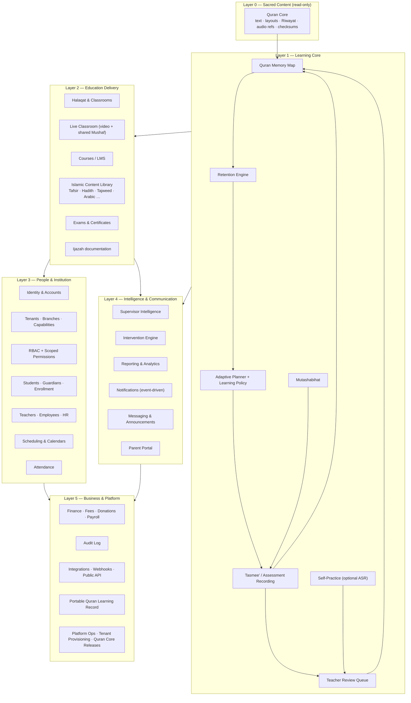
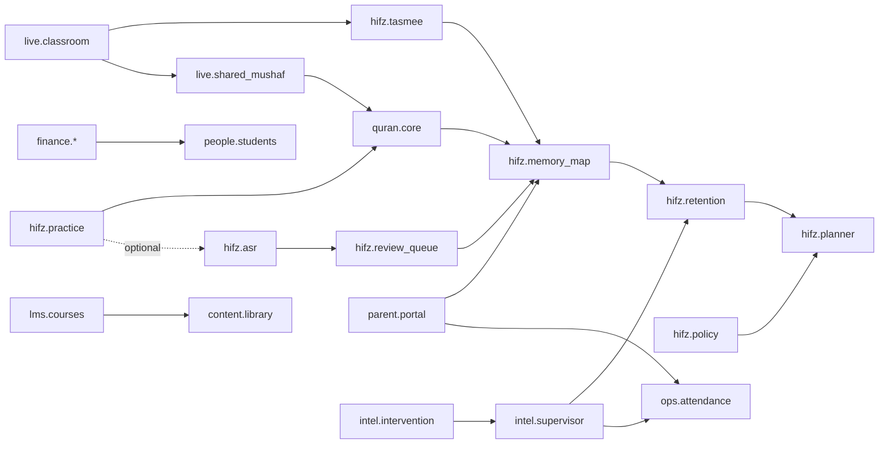

# 02 — Ecosystem Map and Complete Module List

## 2.1 Ecosystem map

The platform is organized as concentric layers around the Quran learning journey. Inner layers never depend on outer layers.

Reading the diagram: the **loop** at the center (Memory Map → Retention → Planner → Tasmee' → Memory Map) is the product. Everything else either feeds it, delivers it, or reports on it.

## 2.2 Applications (surfaces)

| App | Platform | Primary users | Notes |
|---|---|---|---|
| **Admin Web** | Web (desktop-first, responsive) | Owner, admins, supervisors, finance, HR, content managers, support | Full ERP-style interface plus supervisor intelligence |
| **Teacher App** | Mobile/tablet (Flutter), also usable on web | Teachers, assistant teachers, course instructors | Tasmee', attendance, live classroom, review queue |
| **Student App** | Mobile (Flutter) + web PWA | Students | Today, Mushaf, practice, journey, courses, live classroom, offline |
| **Parent App** | Mobile (Flutter) + web PWA | Guardians | Six questions, multi-child, payments, messages |
| **Platform Console** | Web | Platform super admins | Tenant provisioning, Quran Core releases, usage, health |
| **Public API + Webhooks** | HTTPS | Third-party apps, integrators | Versioned REST, event subscriptions |

Teacher, Student, and Parent apps share one Flutter codebase with role-based shells (see `10-technology-stack.md`).

## 2.3 Complete module list

Each module has a stable **module key** used by the capability system (`04-capability-architecture.md`). Features inside a module have **feature keys**. "Core" modules cannot be disabled; everything else is a tenant choice.

### Platform & institution (core)

| Module key | Module | Features (feature keys) |
|---|---|---|
| `platform.identity` | Identity & Accounts | password, magic-link, OTP (sms/email), MFA, SSO (OIDC), session mgmt, device mgmt, account linking (parent↔child) |
| `platform.tenancy` | Tenants & Branches | tenant config, branch config, branding, locales, currency, time zone, calendar, capability assignment |
| `platform.rbac` | Roles & Permissions | system roles, custom roles, scoped grants, permission tests |
| `platform.audit` | Audit Log | immutable audit trail, before/after diffs, export, retention |
| `platform.files` | File & Media Storage | S3-compatible storage, signed URLs, virus scanning, retention policies |
| `platform.notifications` | Notification Engine | event bus subscriptions, templates, channel routing, user preferences, digests |
| `platform.i18n` | Localization | UI languages, RTL/LTR, regional formats, Hijri/Gregorian, tenant string overrides |
| `platform.api` | Public API & Webhooks | API keys, scopes, webhooks, rate limits, idempotency |

### Quran Core (core, read-only)

| Module key | Module | Features |
|---|---|---|
| `quran.core` | Quran Core | Uthmani text (Hafs), Surah/Ayah/word indices, page layouts per Mushaf type, Juz/Hizb/Rub'/Manzil, Sajdah/Waqf markers, Qira'at metadata, reciter registry, audio references, integrity checksums, versioned releases |
| `quran.audio` | Verified Audio | streaming, per-Ayah and per-Surah access, timestamps, caching, offline packs, licensing metadata |
| `quran.mushaf` | Mushaf Renderer | page view, Ayah view, word-level tap targets, highlight overlays, font packs, Riwayah-specific layouts |

### Quran learning

| Module key | Module | Features |
|---|---|---|
| `hifz.journey` | Student Quran Journey | profile, timeline, milestones, level, current position, teacher/Halaqah history |
| `hifz.memory_map` | Quran Memory Map | per-Ayah state, aggregation to page/Surah/Juz, history, weak-region views |
| `hifz.retention` | Retention Engine | retention score, decay model, weak Ayah/page detection, revision priority, explanations |
| `hifz.planner` | Adaptive Planner | daily plan generation, Sabaq/Sabqi/Manzil, teacher approval/override, pause rules, backlog handling |
| `hifz.policy` | Learning Policy Builder | methodology templates, per-Halaqah/per-student policies, thresholds, promotion rules |
| `hifz.tasmee` | Tasmee' / Recitation Assessment | Mushaf-based mistake capture, mistake taxonomy, pass/repeat, session evaluation, quick notes |
| `hifz.assessments` | Formal Assessments & Quran Exams | scheduled exams, rubric scoring, multi-examiner, results, history |
| `hifz.mutashabihat` | Mutashabihat Training | global dataset, teacher-defined sets, confusion tracking, quizzes, personal set |
| `hifz.practice` | Self-Practice | practice sessions, verified hints (text/audio), deterministic quizzes, listening plans, optional self-recording |
| `hifz.asr` | Recitation Mismatch Detection (optional, YELLOW) | ASR provider adapter, confidence thresholds, teacher review routing |
| `hifz.review_queue` | Teacher Review Queue | uncertain items, clips, teacher verdicts, feedback capture |
| `hifz.tajweed` | Tajweed Assessment | Tajweed-specific mistake categories, rubric, theory progress link |
| `hifz.certificates` | Hifz Milestone Certificates | Juz/Hifz completion certificates, templates |
| `hifz.ijazah` | Ijazah Documentation | process record, granting by authorized users only, metadata, verification |

### Islamic education & content

| Module key | Module | Features |
|---|---|---|
| `content.library` | Islamic Knowledge Library | content types, provenance model, verification workflow, versioning, search |
| `content.tafsir` | Tafsir Library | multiple works, languages, Ayah-linked, Surah-level, bookmarks, notes, assignments |
| `content.hadith` | Hadith Library | collections, books, chapters, numbers, text, translations, narrators, sourced grading, tags, memorization |
| `content.tajweed_theory` | Tajweed Theory & Practical | lessons, rules, examples linked to Ayat |
| `content.arabic` | Quran Arabic & Vocabulary | word-by-word, roots, vocabulary lists, drills |
| `content.quran_sciences` | Quran Sciences | Asbab al-Nuzul, themes, Surah introductions, Qira'at overview |
| `content.subjects` | Custom Subjects | Aqeedah, Fiqh, Seerah, manners, tenant-defined subjects |
| `content.center_curriculum` | Center-Created Curriculum | authoring, review, publishing, sharing across branches |

### Courses & online learning

| Module key | Module | Features |
|---|---|---|
| `lms.courses` | Course Management | course/module/lesson, media, readings, assignments, quizzes, exams, prerequisites, learning paths, cohorts, self-paced/scheduled/live/hybrid |
| `lms.homework` | Homework | assignment, submission, grading, parent visibility |
| `lms.exams` | Exams & Quizzes | question banks, scheduling, proctoring settings, results |
| `lms.certificates` | Course Certificates | templates, issuance, verification codes |
| `live.classroom` | Live Classroom | 1:1, group Halaqah, waiting room, controls, hand raise, chat, low-bandwidth, audio-only, reconnect |
| `live.shared_mushaf` | Shared Mushaf | follow-teacher, pointers, highlights, per-student focus |
| `live.halaqah_mode` | Live Halaqah Mode | roster states, active reciter switching, breakout groups, in-class assessment |
| `live.recording_policy` | Recording Policy | tenant-level ON/OFF, watermarks, provider behavior documentation |
| `live.office_hours` | Office Hours | bookable slots, queue |

### People, enrollment, operations

| Module key | Module | Features |
|---|---|---|
| `people.students` | Students | profiles, guardians, documents, status lifecycle, transfers |
| `people.guardians` | Guardians | linking, consent, multi-child, communication preferences |
| `people.teachers` | Teachers | profiles, qualifications, Riwayat, load, availability, evaluations |
| `people.employees` | Employees | staff records, roles, documents |
| `people.hr` | HR | leave, contracts, payroll link |
| `ops.halaqat` | Halaqat | creation, capacity, teacher/assistant assignment, rosters, transfers |
| `ops.classrooms` | Physical Rooms | rooms, capacity, equipment |
| `ops.enrollment` | Enrollment & Waiting Lists | inquiries, applications, placement assessment, waitlist, admission |
| `ops.attendance` | Attendance | sessions, statuses, reasons, alerts, reports |
| `ops.scheduling` | Scheduling | recurring sessions, exceptions, holidays, substitutions, conflicts, make-ups, time zones |
| `ops.calendar` | Center Calendar | academic terms, events, Hijri/Gregorian |

### Communication & parent services

| Module key | Module | Features |
|---|---|---|
| `comm.messaging` | In-App Messaging | policy-restricted threads, teacher↔parent, supervised student messaging |
| `comm.announcements` | Announcements | tenant/branch/Halaqah scope, read receipts |
| `comm.email` | Email Channel | provider adapter |
| `comm.sms` | SMS Channel | provider adapter |
| `comm.whatsapp` | WhatsApp Channel | provider adapter, template management |
| `comm.push` | Push Channel | FCM/APNs |
| `parent.portal` | Parent Portal & App | six-question home, weekly report, achievements, payments, messages |

### Intelligence & reporting

| Module key | Module | Features |
|---|---|---|
| `intel.supervisor` | Supervisor Dashboard | on-track/behind/attention, Halaqah performance, teacher load, retention trends, drill-down |
| `intel.intervention` | Intervention Engine | signal rules, flags, action workflow, outcome tracking |
| `intel.reports` | Reports | academic/administrative/financial reports, filters, export, scheduled delivery |
| `intel.analytics` | Analytics Warehouse (later) | materialized aggregates, tenant metrics |
| `intel.ai_recommendations` | AI Recommendations (optional, YELLOW) | provider adapter, suggestion surfaces, teacher approval |

### Finance

| Module key | Module | Features |
|---|---|---|
| `finance.fees` | Fees & Plans | fee structures, plans, discounts, scholarships, sibling rules |
| `finance.invoicing` | Invoices & Receipts | invoices, receipts, numbering, PDF, multi-currency |
| `finance.payments` | Payments | gateway adapters, manual/cash, reconciliation, refunds |
| `finance.donations` | Donations & Sponsorship | campaigns, sponsor↔student, receipts |
| `finance.expenses` | Expenses | categories, approvals |
| `finance.payroll` | Teacher Payments & Payroll | per-session/per-hour/salary, payouts |
| `finance.accounting_export` | Accounting Integrations | export adapters |

### Portability & integrations

| Module key | Module | Features |
|---|---|---|
| `port.qlr` | Portable Quran Learning Record | export/import, privacy filters, signature, spec version |
| `int.calendar` | Calendar Sync | ICS feeds |
| `int.webhooks` | Webhooks | event subscriptions |
| `int.sso` | SSO | OIDC/SAML for institutions |

## 2.4 Module dependency rules

Rules enforced by the capability system:

1. A module cannot be enabled if a required dependency is disabled (e.g. `hifz.planner` requires `hifz.retention`).
2. Disabling a module hides its UI **and** returns `403 capability_disabled` from its API endpoints.
3. Data belonging to a disabled module is retained (not deleted) so re-enabling restores state.
4. `quran.core`, `platform.*`, `people.students`, `hifz.journey`, `hifz.memory_map` are always on.

## 2.5 Suggested default bundles

Bundles are just presets of module keys; tenants can still toggle individually.

| Bundle | Intended for | Modules |
|---|---|---|
| **Halaqah Essentials** | Mosque, small center | core + hifz.tasmee, hifz.retention, hifz.planner, hifz.policy, ops.halaqat, ops.attendance, ops.scheduling, parent.portal, comm.push, comm.announcements |
| **Center** | Quran school | Essentials + ops.enrollment, finance.fees, finance.invoicing, finance.payments, hifz.assessments, hifz.certificates, intel.supervisor, intel.reports |
| **Online Academy** | Online 1:1 / group academy | Center + live.*, lms.courses, lms.homework, comm.email, comm.whatsapp, finance.donations off by default |
| **Institution** | Multi-branch org | Center + Online Academy + people.hr, finance.payroll, finance.expenses, intel.intervention, int.sso, int.webhooks |
| **Individual Teacher** | One teacher, own students | Essentials minus supervisor modules, plus finance.invoicing |
