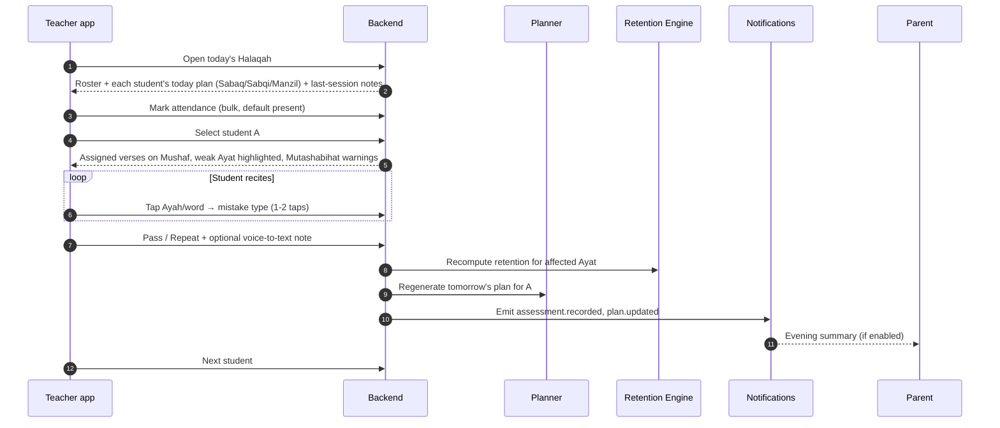
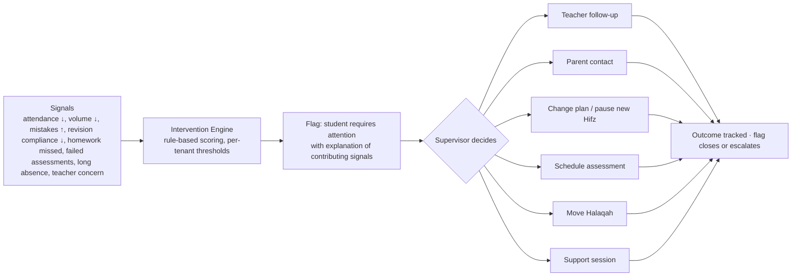

# 03 — User Types, Roles, and Main User Journeys

## 3.1 User types

The system separates **accounts** (a person who can log in), **roles** (bundles of permissions), and **scopes** (the part of the org tree a role applies to). One account can hold many role-scopes: a teacher can also be a parent; a supervisor can teach one Halaqah.

| User type | Typical scope | Core responsibilities | Must NOT see by default |
|---|---|---|---|
| **Platform Super Admin** | Platform (all tenants) | Tenant provisioning, Quran Core releases, platform health, billing of tenants | Tenant learning data beyond support-mode access with audit and consent |
| **Organization Owner** | Tenant | Modules, branding, branches, top-level roles, finance roll-up, all reports | Nothing within tenant, but every access is audited |
| **Center Admin** | Tenant or branch | Day-to-day admin: students, teachers, Halaqat, enrollment, schedules, certificates | Payroll if HR module restricts it |
| **Branch Manager** | Branch | Same as center admin within one branch | Other branches |
| **Academic Supervisor** | Branch or set of Halaqat | Course quality, exams, curriculum, teacher evaluation | Finance |
| **Quran Supervisor** | Branch or set of Halaqat | Hifz outcomes, intervention, plan approvals, teacher load | Finance |
| **Teacher** | Own Halaqat and assigned students | Attendance, Tasmee', plans, homework, parent notes, live classes | Other teachers' students, finance, HR |
| **Assistant Teacher** | Assigned Halaqat | Attendance, listening-only Tasmee' (if policy allows), practice supervision | Editing final assessments unless granted |
| **Course Instructor** | Own courses | Course delivery, grading, live lessons | Hifz data unless also a teacher of that student |
| **Student** | Self | Practice, assignments, journey, classes, exams | Other students' data; raw teacher internal notes |
| **Parent / Guardian** | Linked children | Progress, attendance, reports, messages, payments, consent | Unlinked children, teacher-internal notes flagged private |
| **Finance Employee** | Tenant or branch | Fees, invoices, payments, refunds, donations, expenses | Quran assessment details, mistakes, teacher notes |
| **HR Employee** | Tenant | Staff records, contracts, leave, payroll input | Student learning data |
| **Content Manager** | Tenant | Islamic content library, curriculum authoring, verification workflow | Student PII beyond names in assignments |
| **Support User** | Tenant (limited) | Help desk: reset passwords, fix enrollment errors, view audit | Financial amounts, assessment editing |

## 3.2 Role and scope model (summary)

Detailed in `04-capability-architecture.md`.

```
Account ──< RoleAssignment >── Role
                 │
                 └── Scope: tenant | branch | halaqah | course | student-set | self
```

Examples that must hold in tests:

- A teacher with scope `halaqah:H1` can read/write Tasmee' for students enrolled in H1, and nothing for H2.
- A supervisor with scope `branch:B1` reads all teachers and students in B1, cannot read B2.
- A parent with scope `student:{S1,S2}` reads S1 and S2 progress, cannot read S3 even by guessing IDs.
- A finance employee with `finance.*` permissions gets `403` on `GET /students/{id}/memory-map` even though they can `GET /students/{id}` (limited projection).

## 3.3 Main user journeys

### J1 — Daily in-person Halaqah (teacher)



Target interaction budget: a clean recitation with one mistake is recorded in **≤ 4 taps** (select student, tap word, tap mistake type, tap Pass).

### J2 — Online 1:1 recitation class

1. Student receives "class starting in 10 minutes" push; opens the app; sees class card with teacher, verses to prepare, and a "Join" button that activates 5 minutes before.
2. Join requests a **short-lived scoped classroom token** from the backend (room ID, role, permissions, expiry ≤ 15 minutes, watermark payload).
3. Student lands in the waiting room. Teacher admits.
4. Shared Mushaf opens at the assigned position; the teacher's navigation drives the student's view unless the student un-follows.
5. Teacher runs the same Tasmee' workflow as J1 inside the classroom sidebar.
6. On end: session assessment saved, homework set, attendance auto-marked, media streams discarded (recording policy OFF), parent summary emitted.
7. If the network drops, the client reconnects with the same token while valid; the session assessment draft is preserved locally and synced.

### J3 — Student self-practice (with strict boundaries)

1. Home shows "Today": new memorization (with verified reciter audio), near revision, far revision.
2. Student opens a practice session on a range: listen → read → hide text → recall.
3. Hint request: the app fetches the **exact Ayah from Quran Core** and/or plays the **verified reciter clip**. No generative text or audio exists anywhere in this path.
4. Optional self-recording (if tenant enabled `hifz.asr`): the device uploads or processes audio; the detector reports only "possible mismatch at Ayah X (confidence 0.62)" or "could not evaluate reliably". It never says "correct".
5. Low-confidence or flagged items go to the teacher's review queue with clip, Ayah, timestamp.
6. Student marks the session done; the planner records self-reported completion separately from teacher-verified state.

### J4 — Post-Hifz long-term retention

1. Student status moves from `memorizing` to `retaining` on completion; the journey continues.
2. Policy example: cycle all 30 Ajza' every 40 days, one Juz per day, plus targeted weak-page drills.
3. Weekly Tasmee' of the cycle's portion; retention scores decay without successful recalls and recover with them.
4. Quarterly full-Juz assessments scheduled by the supervisor; results feed the map.
5. Years later the Memory Map still shows which Rub' is fragile.

### J5 — Parent weekly report

Generated every week (tenant-configured day) per child:

| Field | Source |
|---|---|
| Attendance 4/5 | attendance module |
| New memorization 3.5 pages | Tasmee' events with outcome pass on `new` segments |
| Revision 18 pages | Tasmee' events on `revision` segments |
| Retention 82% → 86% | retention engine snapshot delta |
| Teacher note | teacher's parent-visible note (private notes excluded) |
| Homework completed 3/4 | homework module |
| Fee due / paid | finance (only if parent has finance visibility) |
| Next: exam on Thursday | scheduling |

Delivered via push and in-app; email/WhatsApp if configured.

### J6 — Supervisor intervention



No action is executed automatically; the engine only proposes.

### J7 — Enrollment to first class (admin)

1. Inquiry (web form or admin entry) → applicant record.
2. Guardian account created or linked; consent captured (data processing, media policy, communication policy).
3. Placement assessment (teacher records current position and an initial Memory Map seed: "reports memorized Juz 30, verified strong pages: …").
4. Waiting list if no capacity; capacity rules per Halaqah.
5. Admission: Halaqah assignment, schedule, fee plan, policy (methodology) assignment.
6. Student and parent app invitations; first session appears on all calendars.

### J8 — Institution transfer with the Portable Quran Learning Record

1. Guardian (or adult student) requests export → privacy review screen showing what is included.
2. Export is generated as signed JSON (`18-portable-learning-record.md`), optionally including assessment history.
3. New institution imports → mapping review (Riwayah match, Mushaf type) → Memory Map seeded with provenance "imported from institution X, verified locally: no".
4. New teacher runs a verification Tasmee' on sampled pages; imported states are upgraded to locally verified as they are confirmed.

### J9 — Finance: fee cycle

Invoice generated by plan → notification to guardian → payment via gateway adapter, cash, or bank transfer with proof upload → receipt → overdue reminders per policy → scholarship/discount adjustments with approval → reports.

### J10 — Content manager publishes verified Tafsir

Import from a licensed dataset → provenance fields mandatory (author, source, edition, language, publisher, reference, license) → reviewer assignment → verification status `verified_by_reviewer` → publish → available to courses and Ayah view; every later edit creates a version and an audit entry.

### J11 — Ijazah documentation

1. Authorized Sheikh (role with `hifz.ijazah.grant`, granted only by Organization Owner) opens the student's completed assessment history.
2. Records the Ijazah: Riwayah, scope (full Quran or specified), date, chain notes, witnesses, supporting assessments.
3. The record is immutable except via a superseding record; an audit entry is written; the certificate uses the tenant's template.
4. The system never suggests, prefills, or auto-grants an Ijazah.

### J12 — Platform operator releases a new Quran Core version

Data update prepared in the `quran-core` package → validation suite (structure, counts, checksums against reference snapshots, human review sign-off recorded) → tagged release → tenants pick up the version on upgrade; the previous version remains readable for historical records.
