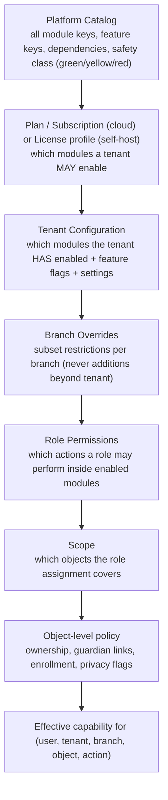
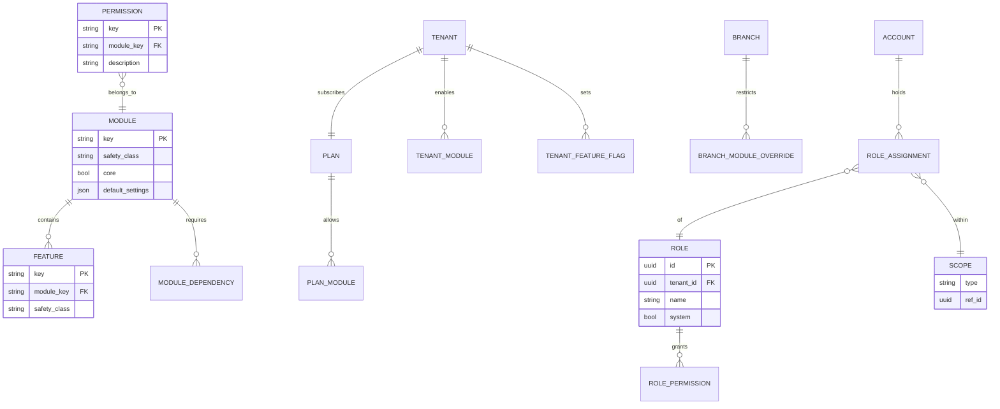

# 04 — Modular Feature-Toggle (Capability) Architecture and RBAC

## 4.1 Goals

1. A tenant enables or disables modules and features **independently**.
2. Availability is **enforced by the backend** on every request, not only hidden in the UI.
3. Dependencies between modules are validated.
4. Permissions are **role + scope** based and evaluated server-side on every object access.
5. The UI receives a single **capability manifest** so it can render the right navigation without duplicating logic.
6. Everything is testable: capability tests and permission tests are first-class in CI.

## 4.2 Layered resolution



Each layer can only **narrow** what the layer above allows. A branch cannot enable a module the tenant disabled; a role cannot grant an action in a disabled module.

## 4.3 Domain model



Permission keys are hierarchical strings: `hifz.tasmee.record`, `hifz.tasmee.edit_own`, `hifz.tasmee.edit_any`, `finance.invoice.issue`, `people.student.read_pii`, `hifz.ijazah.grant`.

## 4.4 Enforcement points

| Layer | Mechanism |
|---|---|
| **HTTP routing** | Every endpoint declares `required_module` and `required_permission`. A router decorator checks module enabled for the tenant (cached), then permission for the user. Missing → `403 {"code":"capability_disabled"}` or `403 {"code":"permission_denied"}`. |
| **Object access** | Every query goes through a **scoped repository** that applies tenant filter + scope filter (e.g. teacher → `student.halaqah_id IN teacher.halaqah_ids`). IDOR is impossible by construction because unscoped queries are not exposed to handlers. |
| **Field projection** | Serializers select fields by permission (finance user sees `student.name`, not `student.memory_map`). |
| **Domain services** | Services re-check capability for cross-module calls (e.g. planner refuses to run if `hifz.planner` disabled), because services can be invoked by workers, not only HTTP. |
| **Background jobs** | Jobs carry `tenant_id` and run under a tenant context; jobs for disabled modules are skipped and logged. |
| **Events** | Consumers check module state before acting (no parent notification if `parent.portal` off). |
| **UI** | Capability manifest endpoint `GET /me/capabilities` returns modules, features, permissions, scopes. UI uses it only for rendering. |

## 4.5 Capability manifest (example)

```json
{
  "tenant": {"id": "t_01H…", "plan": "center", "locale": "ar", "timezone": "Asia/Amman"},
  "modules": {
    "hifz.tasmee": {"enabled": true, "settings": {"mistake_taxonomy": "default+tenant:3"}},
    "hifz.asr": {"enabled": false, "reason": "disabled_by_tenant"},
    "live.classroom": {"enabled": true, "settings": {"recording_allowed": false, "watermark": true}},
    "finance.payments": {"enabled": true, "settings": {"gateways": ["manual", "stripe"]}}
  },
  "features": {"hifz.tasmee.voice_notes": true, "live.classroom.chat": false},
  "permissions": ["hifz.tasmee.record", "ops.attendance.mark", "people.student.read"],
  "scopes": [{"type": "halaqah", "ids": ["h_01", "h_02"]}, {"type": "self"}]
}
```

## 4.6 RBAC with scoped permissions

### System roles (seeded per tenant, editable copies)

`owner`, `center_admin`, `branch_manager`, `academic_supervisor`, `quran_supervisor`, `teacher`, `assistant_teacher`, `course_instructor`, `student`, `guardian`, `finance`, `hr`, `content_manager`, `support`. Plus platform-level `platform_admin` (outside tenants).

### Scope types

| Scope type | Reference | Typical roles |
|---|---|---|
| `tenant` | tenant id | owner, center_admin, finance, hr, content_manager |
| `branch` | branch id | branch_manager, supervisors, finance (branch) |
| `halaqah` | halaqah id(s) | teacher, assistant_teacher, quran_supervisor (subset) |
| `course` | course id(s) | course_instructor |
| `student_set` | explicit student ids | guardian (children), private tutor |
| `self` | the account's own person | student |

### Resolution algorithm (pseudocode)

```
def can(user, action, obj):
    tenant = obj.tenant_id
    if not module_enabled(tenant, action.module): return deny("capability_disabled")
    for ra in user.role_assignments_in(tenant):
        if action.key not in ra.role.permissions: continue
        if scope_covers(ra.scope, obj): return allow(ra)
    return deny("permission_denied")

def scope_covers(scope, obj):
    match scope.type:
        tenant:      return True
        branch:      return obj.branch_id == scope.ref
        halaqah:     return obj.halaqah_id in scope.refs   # or student.enrollments ∩ refs
        course:      return obj.course_id in scope.refs
        student_set: return obj.student_id in scope.refs
        self:        return obj.person_id == user.person_id
```

Object → scope attributes (`branch_id`, `halaqah_id`, `student_id`, `person_id`) are denormalized onto rows for cheap filtering.

### Special policies (object-level)

- **Guardian visibility**: guardian sees child's data only while a `GuardianLink` is active and the child is a minor or has granted visibility.
- **Private teacher notes**: `visibility: private|supervisor|parent`. Parent projections exclude private.
- **Finance isolation**: finance permissions never include `hifz.*.read`; a person with both roles gets both, but the roles stay separate for auditability.
- **Support mode**: platform staff access to tenant data requires an explicit, time-boxed, tenant-approved support session recorded in the audit log.

## 4.7 Feature flags vs modules vs settings

| Concept | Who controls | Example |
|---|---|---|
| **Module** | Tenant owner (within plan) | `live.classroom` |
| **Feature** | Tenant admin | `live.classroom.chat`, `hifz.tasmee.voice_notes` |
| **Setting** | Tenant/branch admin | `live.classroom.recording_allowed=false`, `hifz.policy.default=sabaq_sabqi_manzil` |
| **Experiment flag** (platform) | Platform admin | `ui.new_mushaf_renderer` |

Safety-class constraints: modules and features carry a **safety class** (GREEN/YELLOW/RED, see `07-religious-ai-safety.md`). YELLOW features are **off by default**; RED actions cannot be automated by any configuration.

## 4.8 Tests required

- **Capability tests**: for every endpoint, a test that disabling its module returns `403 capability_disabled`.
- **Permission matrix tests**: generated from a YAML matrix of role × action × scope → expected outcome; the matrix is the documentation.
- **Tenant isolation tests**: every list endpoint queried with tenant A credentials never returns tenant B rows, including via search, filters, and relations.
- **IDOR tests**: direct ID access to objects outside scope returns `404` (not `403`, to avoid existence leaks) for non-admin roles.
