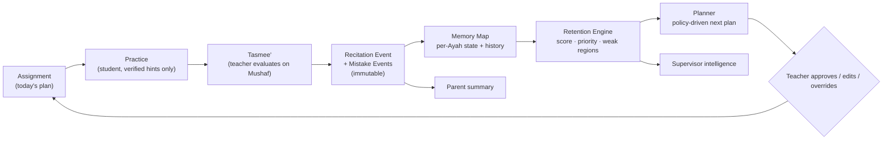
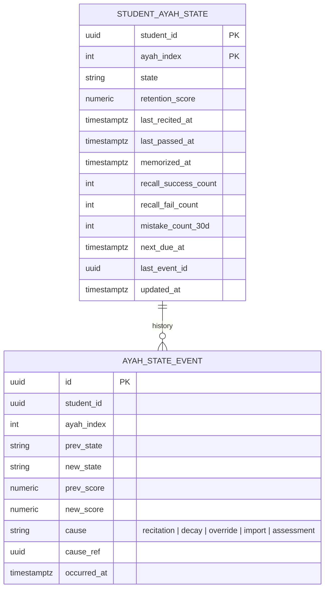

# 05 — Quran Learning Architecture

This is the heart of the product: the Student Quran Journey, the Quran Memory Map, the Retention Engine, the Adaptive Planner with the Learning Policy Builder, the Tasmee' workflow, Mutashabihat training, the Student Hifz Assistant, self-practice, and the Teacher Review Queue.

## 5.1 Core learning loop



## 5.2 The addressing model: Quran units

Everything is keyed to **Ayah identifiers** from the Quran Core: `ayah_key = "{surah}:{ayah}"` with an integer `ayah_index` (1..6236 for Hafs). Coarser units (word, page, Rub', Hizb, Juz, Surah, Manzil) are derived from Quran Core index tables **per Mushaf layout**, never stored ad hoc.

A **segment** is a contiguous range `[ayah_index_from, ayah_index_to]`, optionally with word offsets for partial-Ayah assignments. Plans, assignments, recitations, and assessments all reference segments.

## 5.3 Student Quran Journey profile

| Field group | Fields |
|---|---|
| Configuration | riwayah (`hafs_asim` default), mushaf_type (`madani_15_line`, `indopak_15_line`, …), methodology/policy id, level, start date, current status (`memorizing`, `retaining`, `paused`, `completed_with_retention`, `ijazah_track`) |
| Position | current segment for new memorization (Surah, Ayah, page, Juz), direction (`forward` from Al-Baqarah, `backward` from An-Nas, custom order list) |
| Totals (derived) | total memorized Ayat/pages/Juz, strong, needs revision, weak, critical, mastered |
| Velocity (derived) | pages per week (rolling 4/12 weeks), revision pages per week, revision compliance % |
| History | teacher changes, Halaqah changes, policy changes, level promotions, pauses |
| Assessments | formal exams, results, examiner |
| Milestones | timeline events (below) |
| Certificates / Ijazah | references |

### Timeline events (examples)

`journey.started`, `surah.completed`, `juz.completed`, `juz.count_reached:5`, `juz.count_reached:10`, `hifz.completed`, `retention_phase.started`, `assessment.passed:major`, `ijazah.recorded`, `halaqah.changed`, `teacher.changed`, `policy.changed`, `pause.started`, `pause.ended`.

Completing Hifz changes the student's status and the applicable policy; it never closes the journey.

## 5.4 Quran Memory Map

### States

| State | Meaning (educational) | Typical trigger |
|---|---|---|
| `not_memorized` | never assigned as new memorization | default |
| `learning` | assigned as Sabaq, not yet passed | plan assigns segment |
| `recent` | passed as new memorization within the policy's "recent" window | first pass |
| `strong` | retention score ≥ strong threshold | successful recalls |
| `needs_revision` | retention score below strong threshold or revision overdue | decay / overdue |
| `weak` | retention score below weak threshold or repeated mistakes | mistakes |
| `critical` | retention score below critical threshold or repeated failures | failed recalls |
| `mastered` | sustained strong retention across N cycles with ≤ M minor mistakes | long-term stability |

States are **derived** from the retention score and policy thresholds, and **materialized** per Ayah for fast queries. Teachers may **pin** a state override with reason (e.g. "student has a documented strong Juz 30 from before"), and overrides are recorded as events.

### Storage model (history preserved)



`STUDENT_AYAH_STATE` is the current projection; `AYAH_STATE_EVENT` is the append-only history. Rebuilding the projection from events is a supported maintenance operation. Aggregates for page/Surah/Juz are computed via the Quran Core index tables (materialized per student daily and on write for the affected units).

### Visualization levels

Quran (30 Juz grid) → Juz (Hizb/Rub' strips) → Surah → Page (thumbnail heat) → Ayah (row list with state, score, last recited, mistakes). Color semantics are consistent across levels and use a calm palette with a non-color secondary cue (icon/label) for accessibility.

## 5.5 Retention Engine

### Design constraints

- Deterministic, explainable, versioned; identical inputs give identical outputs.
- Runs without AI. Later AI may **propose parameter tuning**, never replace the algorithm.
- Educational metric only; UI copy never presents it as a religious judgment.
- Per-tenant policy parameters, sensible defaults.

### Inputs per Ayah

| Signal | Source |
|---|---|
| time since last successful recall | recitation events |
| time since memorized | first pass |
| number of successful recalls, and spacing between them | recitation events |
| mistakes (count, severity, type) in recent recalls | mistake events |
| repeated same-location mistakes | mistake events grouped by ayah/word |
| hints used in self-practice | practice events |
| teacher assessment grade (per session or per segment) | assessment events |
| formal exam results covering the Ayah | assessment events |
| student-level factor (personal forgetting rate estimate) | derived, bounded |

### Baseline algorithm (version `retention/v1`)

Per Ayah, maintain a **stability** `S` (days) and compute retention `R(t)` as an exponential forgetting curve, in the family used by spaced-repetition systems (SM-2/FSRS-like), tuned for recitation:

```
R(t) = exp( - (t_since_last_success / S) )         # 0..1
```

Update rules on a recall event (recitation of an Ayah during Tasmee' or verified assessment):

```
on success (no or minor mistakes):
    S = S * growth(quality)      # growth ∈ [1.3, 2.5] depending on quality and spacing
    S = min(S, S_max)            # S_max e.g. 365 days
on failure (major mistake / forgotten / skipped):
    S = max(S_min, S * shrink(severity))   # shrink ∈ [0.2, 0.6]
    R resets to r_fail (e.g. 0.4)
severity weights (policy-configurable):
    forgotten_word 1.0, incorrect_word 0.9, skipped_ayah 1.0, repeated_ayah 0.4,
    mutashabihat 0.8, harakah 0.5, tajweed 0.3, makharij 0.3, waqf_ibtida 0.2, custom = tenant-defined
quality = f(mistake_weighted_sum, hints_used, teacher_grade)
```

A student-level factor `k ∈ [0.7, 1.3]` scales growth, estimated from the student's own history (bounded and slow-moving, explainable as "this student's revisions tend to hold longer/shorter than average").

Outputs:

- `retention_score` = `R(now)` in `[0,1]`, materialized daily (decay job) and on events.
- `state` from thresholds (defaults: strong ≥ 0.85, needs_revision < 0.85, weak < 0.6, critical < 0.35; mastered when `S ≥ S_mastered` and no major mistake in `N` recalls).
- `next_due_at` = time at which `R` would cross the policy's target retention (e.g. 0.9).
- `revision_priority` = `(1 - R) × unit_weight × recency_of_failure_boost × exam_proximity_boost`.
- **Explanation object**: every score carries the top three contributing factors in plain language ("last successful recall 12 days ago", "2 forgotten-word mistakes in the last 3 recitations", "never revised since memorized").

Weak-region detection aggregates Ayah scores to page/Surah/Rub' with a **minimum-based** rule (a page is weak if ≥ X% of its Ayat are weak or any Ayah is critical), because one broken Ayah breaks the page in recitation.

Long-term analysis: monthly retention snapshots per student per Juz for trend charts; declining-retention alerts when the 4-week slope is negative beyond a threshold.

### Engine interface

```python
class RetentionEngine(Protocol):
    version: str
    def apply_recall(self, state: AyahState, event: RecallEvent, policy: RetentionPolicy) -> AyahState: ...
    def decay(self, state: AyahState, now: datetime, policy: RetentionPolicy) -> AyahState: ...
    def explain(self, state: AyahState) -> Explanation: ...
```

The version string is stored on every state event so historical scores are reproducible after algorithm upgrades.

## 5.6 Adaptive Planner and Learning Policy Builder

### Policy model

A **Learning Policy** is a versioned document attached at tenant, branch, Halaqah, or student level (most specific wins, with inheritance).

```yaml
policy:
  key: sabaq_sabqi_manzil_default
  version: 3
  units: page            # page | ayah | surah | lines
  new_memorization:
    daily_amount: 0.5    # pages
    max_daily: 1
    direction: backward  # from Juz 30
    pause_when:
      - critical_ayat_in_last_5_pages >= 3
      - revision_backlog_pages > 10
      - retention_avg_recent_pages < 0.7
  near_revision:         # Sabqi
    window_pages: 20     # last 20 memorized pages
    daily_amount: 2
    repetitions_required: 3
  far_revision:          # Manzil
    cycle_days: 30
    daily_amount_by_total: {"<5 juz": 2, "5-15": 4, ">15": 6}
    ordering: weakest_first  # weakest_first | sequential | mixed
  mastery:
    strong_threshold: 0.85
    weak_threshold: 0.6
    critical_threshold: 0.35
    mastered_after_recalls: 6
  assessment:
    juz_exam_required: true
    passing_score: 90
    max_major_mistakes: 2
  promotion:
    level_up_when: juz_exam_passed
  weekend_days: [fri]
```

Templates shipped: Sabaq/Sabqi/Manzil, "New + Near + Old", page-based weekly, Ayah-based for young children, Surah-based, post-Hifz 30/40/60-day cycles, custom (all fields editable). The **Policy Builder UI** is a form over this schema with validation and live preview ("with this policy, a student with 5 Juz will get ~4 pages of revision per day").

### Plan generation (deterministic)

Daily (or on demand) per student:

1. Check pause conditions → if triggered, produce revision-only plan with explanation.
2. New memorization segment = next `daily_amount` units in the configured direction from the current position, skipping units already `recent`+.
3. Near revision = last `window_pages` memorized, ordered by lowest retention, capped by `daily_amount`.
4. Far revision = due units (`next_due_at ≤ today`) plus cycle position, ordered per `ordering`, capped.
5. Mutashabihat drill if any planned unit is linked to a known confusion for this student.
6. Emit `Plan{date, segments[], rationale[]}` with status `proposed`.

Teacher actions: `approve` (default auto-approve if policy says so), `edit` (change segments/amounts), `override` (replace entirely, with reason), `carry_forward` (unfinished parts). Every action is an event and feeds compliance metrics.

The planner never silently changes an approved plan; if signals change mid-day, it proposes a **revision** the teacher can accept.

## 5.7 Tasmee' (teacher recitation workflow)

### Interaction design goals

- Normal case (pass, 0-2 mistakes) recorded in **≤ 4 taps**.
- Teacher's eyes stay on the Mushaf; controls are at the thumb zone.
- Works on a phone in portrait with one hand; tablet shows Mushaf + side rail.
- Offline-tolerant: events queue locally and sync.

### Screen flow

1. **Student card** shows today's segments (Sabaq/Sabqi/Manzil), last session summary, weak Ayat in the segment (subtle underline), Mutashabihat warnings (small icon at the Ayah).
2. **Mushaf** at the segment start. Tapping a word opens a compact **mistake sheet**: the 9 standard types + tenant custom types as large targets; long-press = "forgotten word" (the most common); a second tap on the same word cycles severity. Swipe on an Ayah = "skipped Ayah". A drag across words marks a range.
3. **Prompts**: "Repeat" button toggles a repetition request marker; a small counter shows repetitions.
4. **Finish**: "Pass" / "Repeat tomorrow" / "Partial" with an optional 10-second voice note (transcribed to text if the tenant enabled that feature; the audio itself is not retained beyond the transcription unless policy says so) or a one-line text note.
5. Next student is preselected (queue order from the Halaqah roster).

### Mistake taxonomy (standard keys)

`forgotten_word`, `incorrect_word`, `skipped_ayah`, `repeated_ayah`, `mutashabihat_confusion` (with optional confused-with Ayah), `harakah`, `tajweed` (with optional rule tag), `makharij` (with optional letter), `waqf_ibtida`, plus `tenant_custom:{id}`. Each carries `severity` (`minor|major`) defaulting per type and per policy.

### Data written

`RecitationSession` (student, teacher, halaqah/class, segment(s), purpose new|near|far|assessment, started/ended, outcome, grade, notes) → `MistakeEvent[]` (ayah_index, word_index?, type, severity, note, confused_with_ayah?) → Memory Map updates → retention updates → planner proposal.

Editing a session later is allowed within a policy window with audit (before/after).

## 5.8 Mutashabihat training system

- **Global dataset**: verified pairs/groups of similar Ayat with the differing words annotated (from an openly licensed dataset if available; otherwise seeded by scholars/teachers and reviewed). Stored in `quran-core` as an **auxiliary, versioned dataset** with its own provenance, separate from the text.
- **Teacher-defined sets**: any teacher can link Ayat as "related" for their students; tenant content managers can promote to tenant-wide.
- **Student confusion tracking**: each `mutashabihat_confusion` mistake records `confused_with`. Repeated confusion (≥ 2 on the same pair) creates a **Personal Mutashabihat item**.
- **Exercises** (all deterministic, text from Quran Core): comparison view (side by side, differing words highlighted), completion (hide the differing word, student picks from verified alternatives, both taken from the two actual Ayat), "which Surah?" placement, sequence (which Ayah follows).
- **Assignments**: teachers assign sets; results feed the personal set and the retention model for both Ayat (mild).

## 5.9 Student Hifz Assistant (boundaries enforced in code)

The assistant is a **rules-based experience** over verified data. Allowed operations and their data sources:

| Capability | Source | Class |
|---|---|---|
| Show today's memorization/revision | Planner | GREEN |
| Play a recitation | Verified audio via `quran.audio` | GREEN |
| Practice session with hide/reveal | Quran Core text | GREEN |
| Text hint (first words, full Ayah) | Quran Core text | GREEN |
| Audio hint (Ayah clip) | Verified audio with timestamps | GREEN |
| Deterministic quizzes (next Ayah, which Surah, fill from verified options) | Quran Core | GREEN |
| Highlight weak material | Memory Map | GREEN |
| Study time organization, reminders | Planner + notifications | GREEN |
| "Possible mismatch at Ayah X" | ASR adapter | YELLOW (opt-in, teacher review) |

Hard prohibitions implemented as **architectural absence**, not as prompts: there is no code path from any LLM or TTS to the Mushaf view, the hint endpoint, or the audio player. The hint endpoint is `GET /quran/{riwayah}/ayah/{key}` on the read-only Quran Core service, and the audio endpoint returns signed URLs to verified files only.

## 5.10 Self-practice with optional recitation mismatch detection

- The feature is a YELLOW module (`hifz.asr`), off by default, requires guardian consent for minors, and can use a local on-device model, a self-hosted server model, or a tenant-provided API through the `SpeechRecognitionProvider` interface (`07-religious-ai-safety.md`).
- The detector's output is a list of **candidate issues** with confidence: `possible_skipped_word`, `possible_substitution`, `possible_skipped_ayah`, `large_mismatch`, `long_pause`, and per-Ayah `evaluation_reliability`.
- Rendering rules: never the word "correct". Allowed phrasings: "No obvious textual mismatch was detected in Ayat 1-5", "Ayah 6 could not be evaluated reliably", "Possible skipped word in Ayah 7 (teacher will review)".
- Items under the tenant's confidence threshold, and any `large_mismatch`, go to the Review Queue. Retention is **not** updated from self-practice ASR results; only teacher verdicts update it.

## 5.11 Teacher Review Queue

Queue item = `{student, surah, ayah, timestamp range, suspected issue, confidence, clip URL (short-lived), context text}`. Teacher actions: `confirm_issue` (choose type), `no_issue`, `tajweed_issue`, `request_repeat`, `ignore_detection`, `note`. Verdicts write normal `MistakeEvent`s (source `review_queue`) and a `DetectorFeedback` record used to evaluate/tune providers offline. Clips are deleted per retention policy (default: 30 days, or immediately after verdict if the tenant chooses).

## 5.12 Formal assessments and exams

Assessment definition (scope: Juz/Surah/pages, rubric: mistakes allowed by type, passing score, examiners, blind second examiner optional) → scheduled session → examiner records using the same Mushaf tool in "assessment mode" (all mistakes counted, no repeat prompts) → score computed by rubric → result, feedback, and Memory Map update (assessment events are weighted higher than daily Tasmee') → certificate eligibility → promotion rule evaluation.

## 5.13 Riwayah and Mushaf configuration

Each student has `riwayah` and `mushaf_type`. The Memory Map is keyed by Ayah index **within the Riwayah's verse numbering**; a mapping table in Quran Core converts between numbering systems where they differ (e.g. some Surahs differ in Ayah counts between Kufi and other counts). Changing a student's Riwayah is a journey event that starts a new map for the new Riwayah while preserving the old.
