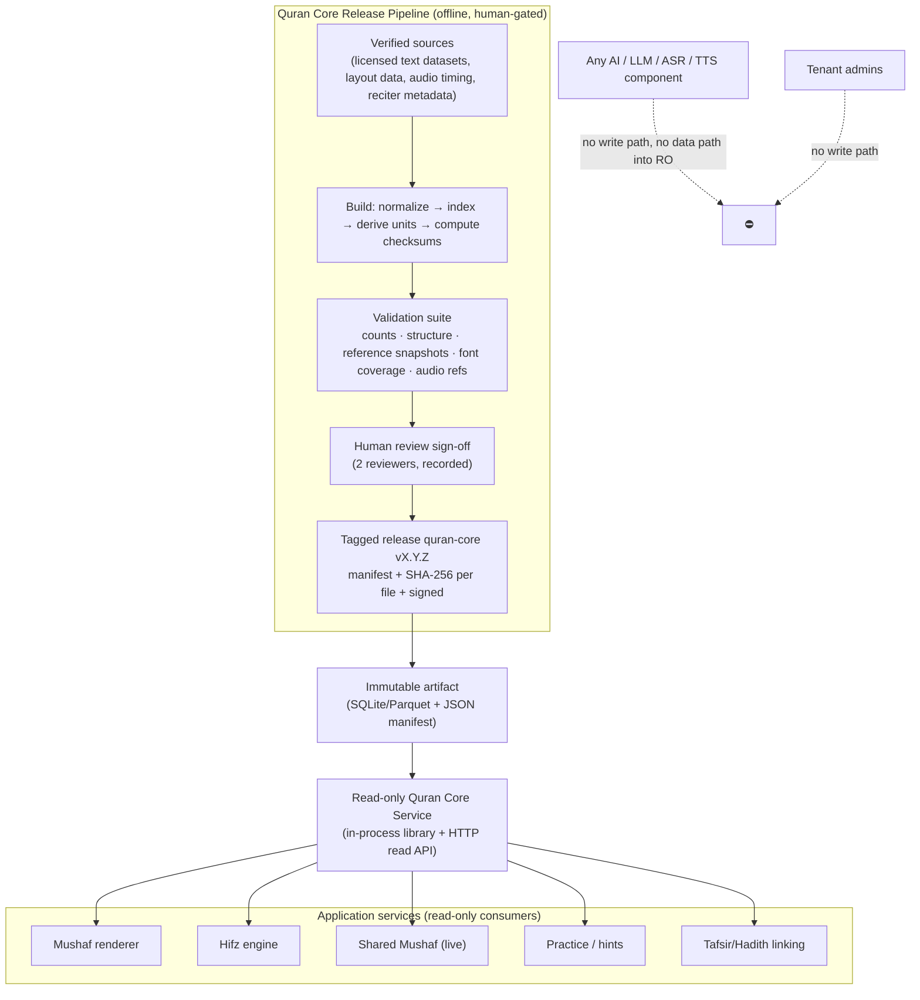

# 06 — Quran Core Architecture (Sacred Content Boundary), Qira'at, and Verified Audio

## 6.1 Purpose

The Quran Core is the **single canonical source** of Quran text and structure inside the platform. It is:

- **immutable at runtime**: no application service, tenant admin, or model has a write path;
- **versioned**: every release is tagged, checksummed, and reproducible;
- **verified**: releases require automated validation, human review sign-off, and provenance;
- **separable**: shipped as its own package (`packages/quran-core`) with its own tests, usable by third parties.

## 6.2 Boundary diagram



## 6.3 Contents of the Quran Core

| Dataset | Description | Keyed by |
|---|---|---|
| `surahs` | 114 Surahs: number, Arabic name, transliteration, translations of the name, revelation type, Ayah count per Riwayah numbering, Rukū' count (Indopak) | surah_number |
| `ayat` | per Riwayah: Uthmani text (with pause marks), simple/clean text (for search only), word list with positions, `ayah_index` global sequence | riwayah, surah, ayah |
| `words` | per Riwayah: word text, position, line/page mapping per Mushaf type, glyph codes for page fonts | riwayah, ayah_key, word_position |
| `layouts` | per Mushaf type: page → lines → words; page ranges for Juz/Hizb/Rub'/Manzil; Surah header positions | mushaf_type, page |
| `units` | Juz, Hizb, Rub' (quarters), Manzil boundaries as `ayah_index` ranges | unit_type, number |
| `markers` | Sajdah positions and type (obligatory/recommended by school, as metadata), Waqf marks per word, Saktah, Basmalah handling | ayah_key, word_position |
| `qiraat` | registry of Qira'at and Riwayat (name, reader, transmitter, verification status, availability flag); numbering maps between Riwayat where verse counts differ | riwayah_key |
| `reciters` | verified reciter registry: name, Riwayah, style (Murattal/Mujawwad), source, license/provenance, audio version | reciter_key |
| `audio_index` | per reciter: file references (Surah files or Ayah files), durations, Ayah/word timestamps, checksums | reciter_key, surah, ayah |
| `mutashabihat` (auxiliary) | verified similar-verse groups with differing-word annotations, provenance, review status | group_id |
| `manifest` | version, build date, source list with URLs/licenses, per-file SHA-256, reviewer sign-offs, signature | — |

Text that is **not** Quran (translations, Tafsir, Hadith) does **not** live in the Quran Core. It lives in the Content Library with its own provenance model.

## 6.4 Release process and integrity

1. **Sources**: only datasets with verified provenance and a license compatible with redistribution (research: `docs/research/quran-data-sources.md`). The manifest records source, version, license, and download hash.
2. **Build** (`packages/quran-core/build/`): deterministic scripts; output files are byte-reproducible from sources.
3. **Validation suite** (CI, must pass):
   - Surah count 114; Ayah count per Riwayah (6236 for Hafs Kufi count); word counts per Ayah match reference;
   - page count per Mushaf type (604 for the Madani 15-line); every word maps to exactly one page/line;
   - Juz/Hizb/Rub' boundaries match reference;
   - Sajdah positions match reference;
   - **golden snapshot**: SHA-256 of every Ayah text compared against the committed snapshot file; any change fails CI unless the PR carries the label `quran-core-release` **and** the manifest bump **and** two reviewer approvals (enforced by branch protection + CODEOWNERS on `packages/quran-core/data/**`);
   - audio index: every referenced file has a checksum and a license record; timestamps monotonic within a Surah;
   - font coverage: every glyph code used by page layouts exists in the shipped font pack.
4. **Human review**: two named reviewers sign the manifest (recorded in `REVIEWS.md` and the manifest JSON).
5. **Release**: tag `quran-core/vX.Y.Z`; publish the artifact; the application pins a version and can serve multiple versions simultaneously (historical records reference the version they were created against).
6. **Runtime protections**: the Core is loaded from the artifact into a read-only store (SQLite in read-only mode or PostgreSQL tables with `REVOKE INSERT/UPDATE/DELETE` from the application role and a trigger that raises on write). A startup check recomputes and compares checksums; mismatch aborts startup.

## 6.5 Read API (internal and public)

```
GET /v1/quran/riwayat                                  → registry
GET /v1/quran/{riwayah}/surahs
GET /v1/quran/{riwayah}/ayah/{surah}:{ayah}              → text, words, page, units, markers
GET /v1/quran/{riwayah}/range?from=2:1&to=2:5
GET /v1/quran/{riwayah}/mushaf/{mushaf_type}/page/{n}    → lines → words with glyph codes
GET /v1/quran/{riwayah}/units/juz/{n}                    → ayah range, pages
GET /v1/quran/reciters
GET /v1/quran/reciters/{key}/audio?surah=2&ayah=5        → signed stream URL(s) + timestamps
GET /v1/quran/manifest                                   → version, checksums, provenance
```

All responses carry `X-Quran-Core-Version`. Responses are cacheable (immutable per version).

## 6.6 Qira'at / Riwayat support

Design rules:

1. `riwayah_key` is a first-class dimension on `ayat`, `words`, `layouts`, `reciters`, and on every student's journey and Memory Map.
2. Hafs 'an 'Asim (`hafs_asim`) ships first with verified text and at least one verified Mushaf layout.
3. A Riwayah is **listed** in the registry with `available: false` until the release pipeline has verified text, layout, and at least one verified reciter for it. Tenants cannot enable an unavailable Riwayah.
4. Where verse numbering differs across Riwayat, `numbering_maps` provide `ayah_index` ↔ `ayah_index` mappings so cross-Riwayah reporting (e.g. "Juz 1 completed") remains correct.
5. Word-level differences (e.g. Warsh orthography, Imala markers) are represented in the Riwayah's own text and font pack; no runtime transformation from Hafs text is ever attempted.
6. Roadmap: Warsh 'an Nafi' and Qalun 'an Nafi' next, then Al-Duri 'an Abi 'Amr and Shu'bah 'an 'Asim, each gated on verified source data and licensing.

## 6.7 Mushaf rendering

- **Page fonts** (glyph-per-word fonts per page, as used by major Mushaf apps) give faithful Madani page reproduction; **text fonts** (OpenType Uthmani fonts) give reflowable text. The renderer supports both, selected by `mushaf_type`.
- Word-level tap targets are derived from layout data, enabling the Tasmee' mistake capture and live pointers.
- Highlights and pointers are **overlays** keyed by `(ayah_key, word_position)`; the text layer is never modified.
- Font packs are distributed with the Quran Core release with license metadata; clients cache them.

## 6.8 Verified Quran audio

### Storage and delivery

| Concern | Decision |
|---|---|
| Storage | S3-compatible object storage, one bucket per environment, prefix `quran-audio/{reciter}/{version}/` |
| Delivery | CDN in front of storage; signed URLs with short expiry for tenant-restricted reciters; public cache for openly licensed reciters |
| File model | **Hybrid**: canonical **Surah-level files** with **verified Ayah/word timestamps** for playback and hints, plus pre-cut **Ayah files** generated deterministically from timestamps for offline packs and low-latency hints. Segmented streaming (HLS) for full-Surah listening on poor networks (phase 2). |
| Client caching | LRU cache of recently played Ayat; explicit downloads by Surah, Juz, or full reciter, stored per reciter with version stamps |
| Versioning | audio version per reciter; changing timestamps or re-encoding bumps the version; clients invalidate by version |
| Bundling | never bundled in the app binary |

Why hybrid: Surah files minimize object count and CDN overhead for listening; Ayah-level cuts make hints instant and offline packs granular; timestamps make both consistent. Single-model alternatives fail one of the use cases (per-Ayah only: 6,236 objects × reciters and gap artifacts; per-Surah only: seeking on mobile networks is slow for hints).

### Licensing and provenance

- Each reciter record stores: source, rights holder, license or written permission reference, permitted uses (streaming, download, redistribution), attribution text, and the date verified.
- The open-source repository **does not ship audio files**. It ships the audio index schema, the ingestion tool, and a list of sources with license status. Operators import reciters whose license permits their use; the platform refuses to enable a reciter without a license record.
- Where a reciter's recordings are widely circulated but rights are unclear, the registry marks them `license_status: unclear` and they are not enabled by default.

### Prohibitions

- No generative TTS anywhere in the audio path. The `AudioProvider` interface has exactly one implementation type: `VerifiedRecordingSource`.
- Student and teacher recordings (practice clips, review-queue clips) are stored in a **separate bucket** with short retention and are never mixed with the reciter library.

## 6.9 Package layout

```
packages/quran-core/
  data/                  # release artifacts (git-lfs or downloaded at build), never edited by hand
    manifest.json
    hafs_asim/ayat.parquet, words.parquet, layouts/madani_15.parquet, units.json, markers.json
    reciters.json, audio_index/
    mutashabihat/groups.json
    snapshots/ayah_sha256.txt          # golden checksums (committed)
  build/                 # deterministic build scripts from sources
  validation/            # test suite run in CI
  python/quran_core/     # read-only accessor library
  README.md, PROVENANCE.md, REVIEWS.md, LICENSE-DATA.md
```
