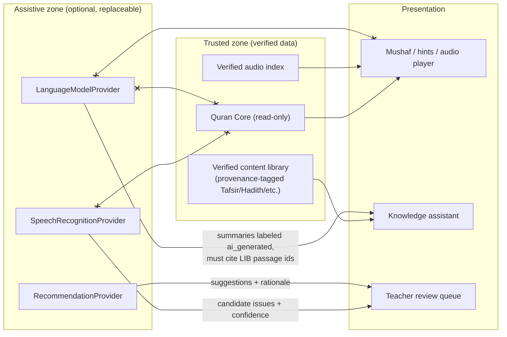

# 07 — Religious AI Safety Architecture

## 7.1 Non-negotiable rule

When convenience, automation, engagement, or speed conflicts with preservation of Quran accuracy, **Quran accuracy wins**. When automation is uncertain, **do less**.

This document turns that rule into architecture: boundaries enforced by code structure, not by prompts or policy documents alone.

## 7.2 The three safety classes

Every intelligent or automated feature is classified. The class is stored in the platform catalog (`04-capability-architecture.md`) and displayed in the admin UI next to the toggle.

### GREEN — deterministic, safe to automate

| Feature | Why green |
|---|---|
| Displaying verified Quran text and Mushaf pages | Data from the immutable Quran Core |
| Playing verified reciter recordings | Data from the verified audio index |
| Retention score, revision scheduling, plan generation | Deterministic, explainable algorithms over recorded events |
| Attendance, scheduling, fees, invoices | Ordinary business logic |
| Deterministic quizzes built from Quran Core (next Ayah, which Surah, verified-option completion) | No generated content |
| Reports and aggregations | Arithmetic |
| Notifications on events | Routing |

### YELLOW — assistive, automated but never authoritative, off by default

| Feature | Constraints |
|---|---|
| Speech recognition mismatch detection | Reports *possible* issues with confidence; never "correct"; low confidence → teacher review; never updates retention directly |
| Learning recommendations (pace, pause, extra revision) | Presented as suggestions with rationale; teacher accepts/rejects; logged |
| Dropout / attention risk | Rule-based first; any model-based scoring shows contributing signals; no automatic action |
| Performance analysis narratives | Clearly labeled as generated summaries of listed data; underlying numbers always visible |
| Search assistance over verified Tafsir/Hadith | Retrieval-first; returns passages with citations; summaries labeled and linked to sources |
| Teacher note voice-to-text | Transcription of the teacher's own words, editable before save |

### RED — requires qualified human authority; the system cannot automate

| Decision | System's role |
|---|---|
| Final judgment that a recitation is correct (Tajweed, Makharij) | Records the teacher's judgment only |
| Certification of Tajweed/Makharij competence | Records certificates issued by authorized people |
| Granting Ijazah | Records an Ijazah entered by a user with the `hifz.ijazah.grant` permission; no suggestion, no prefill |
| Religious rulings (Fatwa) | Out of scope; assistants refuse and point to the center's qualified staff |
| Quran textual authority | Quran Core only; no other source |
| Hadith authenticity judgments | Displays sourced gradings with attribution; never produces a grading |
| Authoritative Tafsir | Displays verified works; AI may only summarize named verified sources with labels and links |

RED constraints are implemented as **absence of capability**: there is no API, no job, and no configuration that lets software perform these actions.

## 7.3 Sacred Content Boundary (technical)



Enforcement mechanisms:

1. **Type-level separation**: Quran text is carried in a `SacredText` value type produced only by the `quran_core` package. UI components that render the Mushaf accept only `SacredText`. LLM outputs are `GeneratedText`, and there is no conversion function. A lint rule (custom `ruff`/`flake8` plugin and an ESLint rule) forbids importing AI provider modules inside `quran_core`, `mushaf`, and `hifz.practice.hints`.
2. **Storage separation**: the Quran Core store is read-only at the database-role level; AI outputs are stored in tables with a mandatory `provenance = ai_generated` column and a mandatory `source_refs` array for summaries.
3. **Rendering separation**: any `GeneratedText` component renders with a persistent visual label ("AI-generated summary of: [sources]") that cannot be disabled by tenant theming.
4. **Validation on ingest**: content imported into the library must carry `content_class ∈ {canonical, scholarly, center_created, ai_generated}`; Quran-like text in any non-canonical record is detected (n-gram match against Quran Core) and flagged for review to prevent a Hadith or Tafsir record from silently carrying altered Quran text.
5. **Prompt-side guardrails** (defense in depth, not the primary control): system prompts forbid quoting Quran from memory and require passage ids; outputs are post-checked, and any Arabic span that matches Quran text must exactly equal Quran Core text or the response is rejected.

## 7.4 AI provider abstraction

All AI is optional. Interfaces live in `packages/ai-providers`:

```python
class SpeechRecognitionProvider(Protocol):
    def analyze_recitation(self, audio: AudioRef, expected: list[SacredText], riwayah: str) -> RecitationAnalysis: ...
    # RecitationAnalysis: per-ayah reliability, candidate issues with type + confidence + time range

class LanguageModelProvider(Protocol):
    def summarize_sources(self, passages: list[LibraryPassage], question: str, lang: str) -> GeneratedText: ...
    def transcribe_note(self, audio: AudioRef, lang: str) -> GeneratedText: ...

class RecommendationProvider(Protocol):
    def suggest_plan_adjustments(self, journey: JourneySnapshot, policy: LearningPolicy) -> list[Suggestion]: ...
    def score_attention_risk(self, signals: RiskSignals) -> RiskScore: ...

class KnowledgeRetrievalProvider(Protocol):
    def search(self, query: str, corpus: CorpusFilter, lang: str) -> list[LibraryPassage]: ...
```

Implementations (shipped or pluggable): `NullProvider` (default, everything disabled), local models (on-device or self-hosted), cloud APIs via tenant-supplied keys. No vendor is required. Tenants toggle each provider independently; disabling all of them leaves the platform fully functional.

## 7.5 Speech recognition rules (YELLOW)

- Purpose statement in UI: "helps you notice possible mistakes to practice; your teacher decides."
- Output vocabulary limited to: `possible_skipped_word`, `possible_substitution`, `possible_skipped_ayah`, `large_mismatch`, `long_pause`, `unreliable_segment`.
- Copy rules: allowed "No obvious textual mismatch was detected"; forbidden "correct", "perfect", "your Tajweed is right".
- Thresholds per tenant with safe defaults; anything under threshold or any `large_mismatch` routes to the Teacher Review Queue.
- Retention and the Memory Map are updated **only** by teacher verdicts.
- Minors: requires guardian consent for audio processing; clips have short retention; on-device processing preferred when available.
- Model improvement: teacher verdicts produce `DetectorFeedback` for offline evaluation and optional fine-tuning by operators; models never gain authority over the text.

## 7.6 Knowledge assistant rules (YELLOW)

Retrieval-first pipeline:

1. Parse the question → identify Ayah/Hadith references and named works.
2. Search the verified library (PostgreSQL full-text initially, vector search later) restricted to verified content.
3. Return passages with exact citations (work, edition, volume/page or id).
4. Optional summary generated **only from the returned passages**, labeled, with links; if no passages are found, the assistant says so and does not answer from model memory.
5. Requests for rulings are declined with a pointer to human staff.

## 7.7 Ijazah, certificates, and authority records

- Ijazah records are created only through an endpoint that requires `hifz.ijazah.grant`, which only Organization Owners can assign, and which the platform never assigns by default to any system role.
- The record captures grantor, student, Riwayah, scope, date, chain notes, witnesses, supporting assessment ids, and free-text notes. It is immutable; corrections create a superseding record.
- Certificates for courses and Hifz milestones are generated from templates, but the **trigger is human** (an admin or teacher issues), and the audit log records the issuer.

## 7.8 Testing the boundary

- **Static tests**: import-boundary lints fail CI if AI modules are imported into sacred-content modules.
- **Snapshot tests**: Quran text checksums (see `06-quran-core-architecture.md`).
- **Contract tests**: every `GeneratedText` returned by any provider must pass `contains_no_unverified_quran()`; Arabic spans matching Quran n-grams are diffed against Quran Core.
- **UI tests**: the "AI-generated" label is present on every generated component in every theme.
- **Permission tests**: no role except explicitly granted can call Ijazah endpoints; `NullProvider` is the default in fresh tenants.
