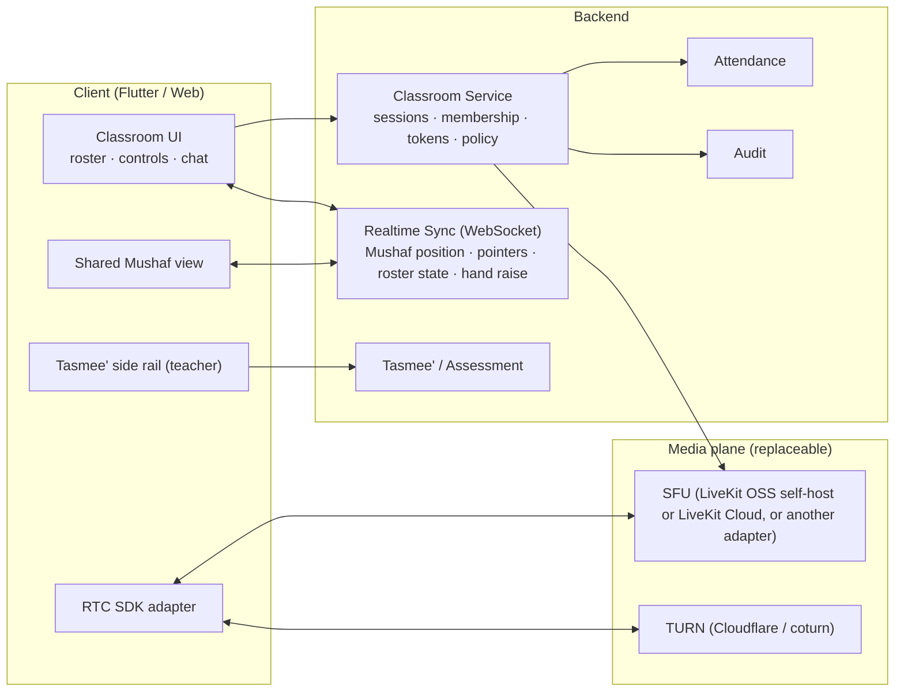

# 08 — Online Classroom Architecture

Covers the Quran Virtual Classroom, shared Mushaf, live Halaqah mode, the non-recorded (live-only) policy, the video provider abstraction, and classroom security.

## 8.1 Principles

1. The classroom is a **product surface**, not a Zoom link: it embeds the Tasmee' workflow, the shared Mushaf, attendance, and assessment.
2. **Audio-first.** Recitation is an audio activity; video is optional, off by default for students, and capped at 360p unless the tenant raises it. This is also the single largest cost lever (see `09-video-provider-comparison.md`).
3. **Live-only by design** when the tenant disables recording: no server-side recording, no provider recording APIs, no media retention, no replay URLs.
4. **Provider-agnostic.** All application logic talks to an `RtcProvider` interface; LiveKit is the reference adapter.
5. **Short-lived, scoped tokens.** Clients never hold provider secrets.
6. **Works on bad networks.** Audio-only mode, adaptive bitrate, reconnect with state recovery.

## 8.2 Components



Two planes:

- **Control/data plane** (our backend): who is in the class, roles, Mushaf position, pointers, roster states, assessments, attendance. Delivered over our own WebSocket channel so it is provider-independent.
- **Media plane** (provider): audio/video transport only. Swapping the provider changes only the `RtcProvider` adapter and the client SDK wrapper.

## 8.3 Session lifecycle

1. **Scheduled** by the scheduling module (recurring Halaqah or 1:1 slot) → `LiveSession` row with `room_key`.
2. **Opening**: the teacher (or auto at T-5 min) opens the room; backend creates the provider room via the adapter with **recording disabled** flags and the tenant's limits (max participants, video policy).
3. **Join**: client calls `POST /live/sessions/{id}/join` → backend checks capability + permission + enrollment + schedule window → returns `{provider, room, token(ttl≤15m, identity, grants), sync_ws_url, sync_token, watermark_payload}`.
4. **Waiting room**: student tokens carry `can_publish=false` until admitted; the teacher admits via the sync channel; backend re-issues a publish-capable token.
5. **In session**: sync events (below); Tasmee' events written through the normal assessment API; attendance auto-marked on join with `join_at`, `leave_at`, and durations.
6. **End**: teacher ends → provider room closed → all tokens revoked → attendance finalized → session assessment saved → events emitted (`live.session.ended`, `attendance.recorded`, `assessment.recorded`).
7. **Failure modes**: teacher disconnect (assistant or auto-pause after N minutes, students see status), student disconnect (rejoin with same token while valid), provider outage (session marked `interrupted`, make-up flow available).

## 8.4 Sync protocol (provider-independent)

Channel: `wss://…/live/{session_id}` authenticated by the sync token. Messages are small JSON, ordered per session, with server-side authorization per message type.

| Message | Sender | Effect |
|---|---|---|
| `mushaf.navigate {ayah_key, page}` | teacher / assistant | Followers move to the location |
| `mushaf.follow {on/off}` | student | Student toggles auto-follow |
| `pointer.set {ayah_key, word_position, style}` / `pointer.clear` | teacher | Overlay pointer on followers' Mushaf |
| `highlight.set {range, color}` | teacher | Persistent overlay (no text change) |
| `roster.state {student_id, state}` | teacher / assistant | `reciting`, `ready`, `waiting`, `reviewing`, `absent` |
| `hand.raise` / `hand.lower` | student | Roster indicator |
| `mic.request` / `mic.grant` / `mic.revoke` | student / teacher | Backend re-issues token with publish grant or asks the adapter to mute |
| `chat.message` | any (if enabled) | Policy-filtered chat |
| `session.watermark` | server | Rotating watermark payload |

The server persists roster states and highlights for the session (small, non-media); pointer/navigation events are ephemeral.

## 8.5 Shared Mushaf

- Renders from the Quran Core with the student's Riwayah and Mushaf type; if the teacher's Mushaf type differs, the backend maps by `ayah_key` and the follower sees the same Ayah in their own layout.
- Pointers and highlights are overlays keyed by `(ayah_key, word_position)`; the text layer is untouched.
- The teacher's Tasmee' rail is the same component as in-person Tasmee', so mistakes captured live flow into the same events.
- Students in a group can be in "follow" or "free" mode; the teacher can force-follow for the reciting student.

## 8.6 Live Halaqah mode

Roster example: Student A — Reciting; B — Ready; C — Waiting; D — Reviewing; E — Absent.

- **Sequential Tasmee'**: the teacher advances the active reciter; only the active reciter (and teacher/assistant) publish audio by default; others are muted and may be in "reviewing" (working on their own assigned revision inside the same app view) while listening.
- **Assistant teacher**: can admit, mute, set roster states, and (if policy allows) run listening-only Tasmee' in a breakout.
- **Breakout groups**: sub-rooms created through the adapter; the sync channel scopes messages by breakout.
- **Attendance and evaluation** happen in-session; leaving early is captured.
- **Women's centers**: audio-only enforced at the tenant/branch level; camera toggles hidden; watermark still applied to the Mushaf view.

## 8.7 Recording policy ("Allow Session Recording": ON/OFF)

When OFF (default):

| Guarantee | Implementation |
|---|---|
| No server-side recordings | Adapter never calls egress/recording APIs; self-hosted deployments do not deploy the egress component at all |
| No provider recording controls | Room created with recording disabled; UI hides all recording affordances; API returns `403 capability_disabled` for any recording endpoint |
| No media retention | Media flows through the SFU only; nothing written to storage; logs contain no media |
| No replay URLs | No recording objects exist; no endpoints generate them |
| Provider behavior documented | Each adapter ships `RECORDING.md` describing exactly what the provider retains (e.g. LiveKit: nothing unless Egress is invoked; managed cloud may keep transient buffers for seconds; metadata retention per provider policy) |

Deterrence (optional per tenant): rotating visible watermark on the video tiles and Mushaf view containing a hashed participant identifier + session id + timestamp; screenshot detection on iOS/Android where the OS exposes it (informational only); disabling picture-in-picture; `FLAG_SECURE` on Android (blocks screenshots/screen recording for the app window on most devices); iOS has no equivalent API for arbitrary views, and browsers offer none.

**Honest product promise:** "Live-only by platform design, with recording disabled and deterrence controls." Users can still record with another device, OS-level tools on jailbroken/rooted devices, external capture hardware, or a camera pointed at the screen. The platform does not claim otherwise, and the tenant admin UI shows this statement next to the toggle.

When ON: recording is an explicit per-session action by the teacher, announced to all participants (banner + audio cue), requires guardian consent flags for minors, is stored in a separate bucket with tenant-defined retention, and is auditable.

## 8.8 RtcProvider interface

```python
class RtcProvider(Protocol):
    key: str                                    # "livekit", "jitsi", "stream", …
    capabilities: RtcCapabilities               # e2ee, breakout, max_participants, regions, recording_supported

    def create_room(self, spec: RoomSpec) -> Room: ...
        # RoomSpec: name, max_participants, audio_only, video_max_res, recording=False, region_hint, empty_timeout
    def close_room(self, room_id: str) -> None: ...
    def issue_token(self, room_id: str, identity: str, grants: Grants, ttl: timedelta) -> str: ...
        # Grants: can_publish, can_subscribe, can_publish_data, hidden, metadata(role, watermark)
    def update_participant(self, room_id: str, identity: str, grants: Grants) -> None: ...
    def mute_participant(self, room_id: str, identity: str, track: str) -> None: ...
    def remove_participant(self, room_id: str, identity: str) -> None: ...
    def create_breakout(self, parent_room_id: str, spec: RoomSpec) -> Room: ...
    def list_participants(self, room_id: str) -> list[Participant]: ...
    def verify_webhook(self, headers, body) -> RtcEvent: ...   # participant joined/left, room ended, quality stats
```

Client side: a thin `RtcClient` wrapper in the Flutter/web apps with the same surface (join, publish audio, subscribe, mute, active speaker, connection quality). Adapters shipped: `livekit` (reference, self-host and cloud), `jitsi` (self-host/JaaS) second, `stream` and `cloudflare_realtimekit` as community adapters when stable. Provider selection is a tenant setting; the platform operator sets the default.

## 8.9 Bandwidth and quality

| Mode | Audio | Video | Target uplink |
|---|---|---|---|
| Audio-only (default for students) | Opus 24–40 kbps, DTX, FEC | none | ≈ 50 kbps |
| Low-bandwidth video | Opus 24 kbps | 180p 100 kbps | ≈ 150 kbps |
| Standard | Opus 40 kbps | 360p 400 kbps | ≈ 500 kbps |
| High (tenant opt-in) | Opus 64 kbps | 720p 1.5 Mbps | ≈ 1.6 Mbps |

Simulcast for teacher video; students subscribe only to the teacher and the active reciter. Client shows a connection quality indicator and auto-downgrades to audio-only.

## 8.10 Security

- Join tokens: TTL ≤ 15 minutes, bound to identity, room, role, and grants; refreshable only via the backend while the session is open.
- Provider API keys live only on the backend (secrets manager / env); never shipped to clients.
- Room names are unguessable (`room_key` random 128-bit), and membership is checked on every join regardless of room name.
- Webhooks verified by signature; events reconciled with our session state.
- Rate limits on join/leave; anomaly alerts on repeated join failures.
- E2EE optional for 1:1 sessions where the adapter supports it (LiveKit does); documented trade-offs (no server-side processing possible).
- Minors: teacher identity verified by the tenant; students cannot start sessions; chat and direct messages governed by the communication policy.

## 8.11 Observability

Per session: join success rate, time-to-first-audio, reconnect count, packet loss/jitter percentiles (from provider stats), audio-only fallback rate, region. Aggregated per tenant and per provider for cost and quality dashboards. No media content is logged.
