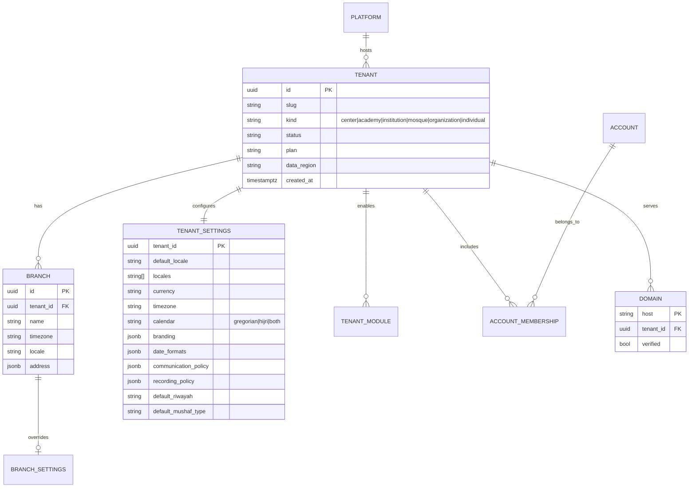
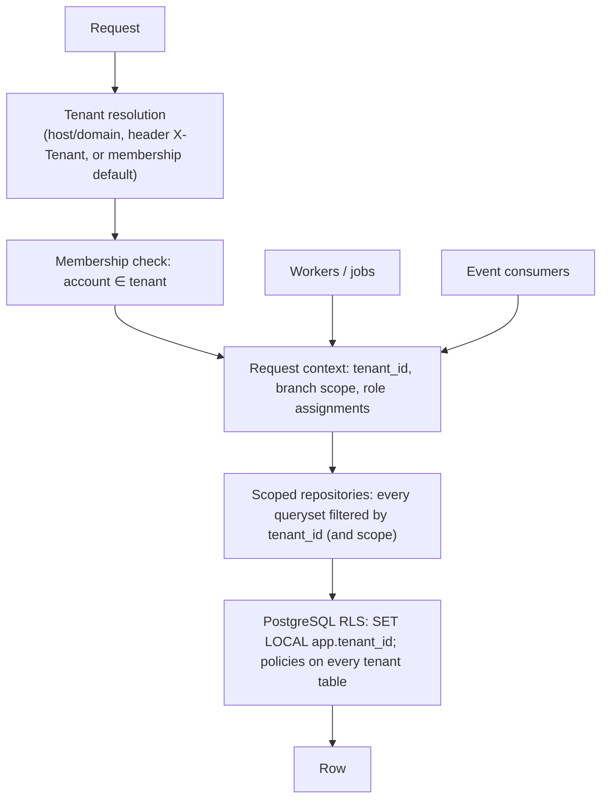

# 11 — Multi-Tenant Architecture

## 11.1 Tenant model

- A **tenant** is the isolation boundary: a Quran center, academy, institution, mosque, organization, or an individual teacher.
- **Branches** are organizational sub-units with their own time zone, locale, rooms, staff, and optional setting overrides. Branches are not isolation boundaries; scoped permissions handle visibility.
- **Accounts** are global (one login), with **memberships** in one or more tenants (a teacher in two centers, a parent with children in two institutions). Data never crosses tenants; only the login does.
- `data_region` prepares for regional database placement (see 11.4).

## 11.2 Isolation strategies compared

| Strategy | Isolation | Ops cost | Cross-tenant features (platform analytics, shared accounts) | Migrations | Scale ceiling | Fit |
|---|---|---|---|---|---|---|
| **Shared DB, shared schema** (`tenant_id` column everywhere + RLS) | Logical; strong when RLS is enforced at the DB role level and every query is scoped | Lowest: one database, one migration run | Easy | One run | Very high with partitioning; largest tenants can be moved out | **Recommended for v1** |
| Shared DB, schema per tenant (e.g. django-tenants) | Stronger logical separation; accidental leaks require schema-switch bugs | Medium: N schemas × migrations, connection pooling complexity, slow migrations at thousands of tenants | Harder (cross-schema queries) | N runs | Thousands of schemas strain PostgreSQL catalogs | Not recommended |
| Database per tenant | Physical; simplest compliance story | High: N databases, backups, monitoring, connection pools, migrations | Hard | N runs | Bounded by ops tooling | Offer as an option for large or regulated tenants (v2) |

**Recommendation:** shared database, shared schema, `tenant_id` on every tenant-owned row, PostgreSQL row-level security as a second line of defense, plus application-level scoped repositories. Add a **tenant → database routing** layer later so a large or regulated tenant can be moved to its own database (same schema) without changing application code. This is the most practical design for an open-source project that must run on one VPS and still scale.

## 11.3 Enforcement layers

1. **Tenant resolution** per request from the custom domain or slug, the `X-Tenant-Id` header for API clients, or the account's default membership; ambiguity is an error, never a guess.
2. **Context propagation** through a request-local context object; Celery tasks and event consumers receive `tenant_id` explicitly and re-establish the context.
3. **Scoped repositories**: model managers expose only `for_tenant(ctx)` querysets; unscoped access requires an explicitly named `unsafe_all()` used only in platform admin and audited.
4. **Row-level security**: the application connects with a role subject to RLS policies `USING (tenant_id = current_setting('app.tenant_id')::uuid)`; the context sets `SET LOCAL app.tenant_id` per transaction. Platform-admin operations use a separate role with policies for support sessions.
5. **Storage**: object keys prefixed `tenants/{tenant_id}/…`; signed URLs generated only after the same checks.
6. **Search indexes and caches** carry the tenant id in keys.
7. **Tests**: isolation tests run every list/search endpoint across two seeded tenants and assert zero leakage; RLS tests attempt raw queries under the app role.

## 11.4 Regional data placement and self-hosting

- The cloud edition maps `data_region` → database cluster and storage bucket region (e.g. `eu`, `me`, `apac`). Media (LiveKit region hint) follows the tenant's region.
- Organizations with strict requirements self-host: the same code, Docker Compose, their own PostgreSQL and storage. Privacy research (`docs/research/fonts-and-privacy.md`) shows Egypt requires transfer licenses and Indonesia's public sector requires in-country storage; self-hosting is the answer for those cases.

## 11.5 Tenant configuration hierarchy

| Setting | Platform default | Tenant | Branch | Halaqah/Course | Student |
|---|---|---|---|---|---|
| Locale, RTL, date formats | ✓ (default `ar`, RTL; `en` supported) | ✓ | ✓ | – | user preference |
| Time zone | – | ✓ | ✓ | ✓ (online sessions) | user |
| Currency | – | ✓ | ✓ (multi-currency branch) | – | – |
| Branding (logo, theme colors, app name) | ✓ | ✓ | ✓ (logo) | – | – |
| Calendar (Gregorian/Hijri/both) | ✓ | ✓ | ✓ | – | – |
| Modules and features | plan | ✓ | restrict only | – | – |
| Learning policy | template | ✓ | ✓ | ✓ | ✓ |
| Recording policy | OFF | ✓ | restrict only | – | – |
| Communication policy (who can message whom) | safe default | ✓ | ✓ | – | – |
| Data retention | safe default | ✓ | – | – | – |
| Default Riwayah / Mushaf type | Hafs / Madani | ✓ | ✓ | ✓ | ✓ |
| Notification channels | – | ✓ | ✓ | – | user preference |

Resolution: most specific non-null wins; branches and lower levels can only narrow module availability, never widen.

## 11.6 Tenant lifecycle

`provisioning` (create tenant, owner account, default roles, default policy, seed catalog) → `active` → `suspended` (read-only, billing or abuse) → `offboarding` (export bundle generated, retention countdown) → `deleted` (hard delete after retention; audit log summary retained). Every transition is audited and emits events.

## 11.7 Individual teachers

An individual teacher is a tenant of kind `individual` with one branch, the "Individual Teacher" bundle, and the same isolation. When the teacher later joins an institution, their students can be **transferred** with the Portable Quran Learning Record, keeping history and provenance.
