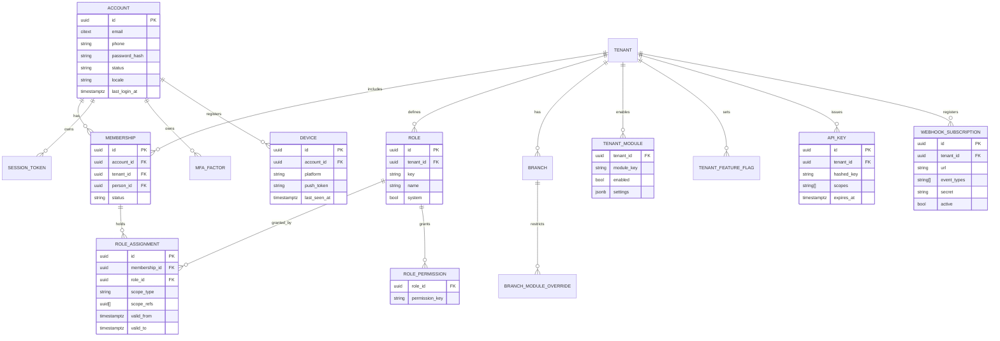
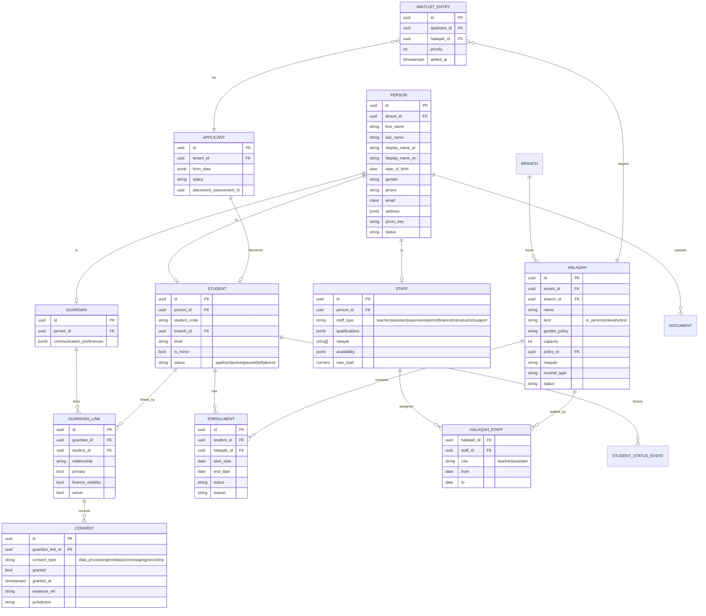
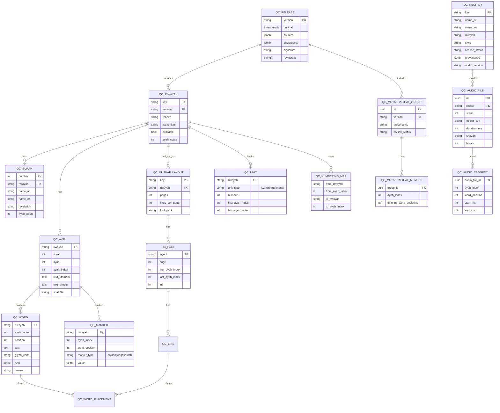
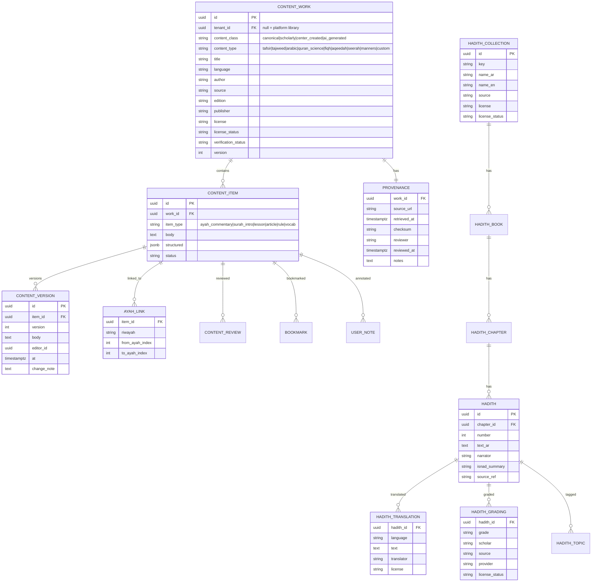
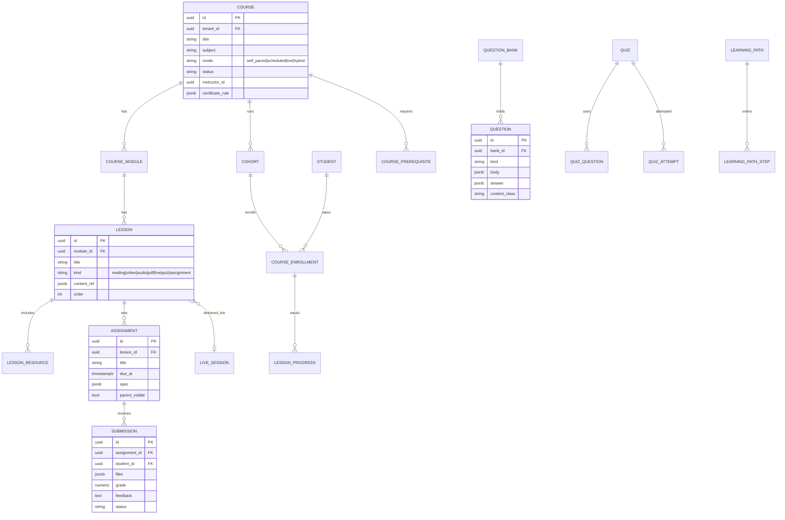
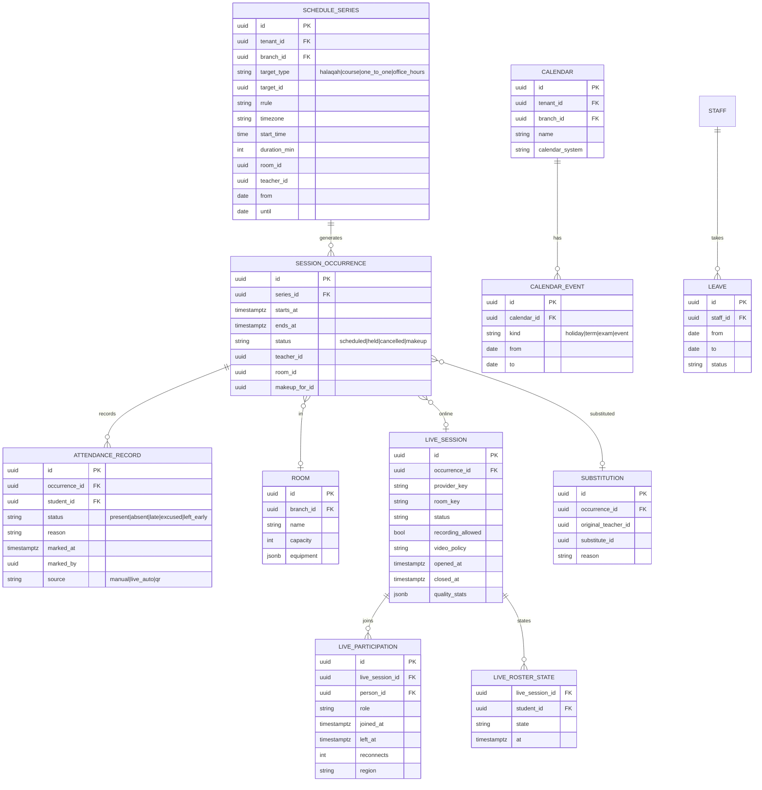
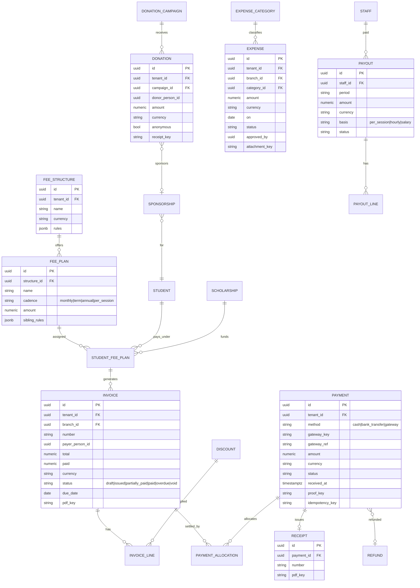
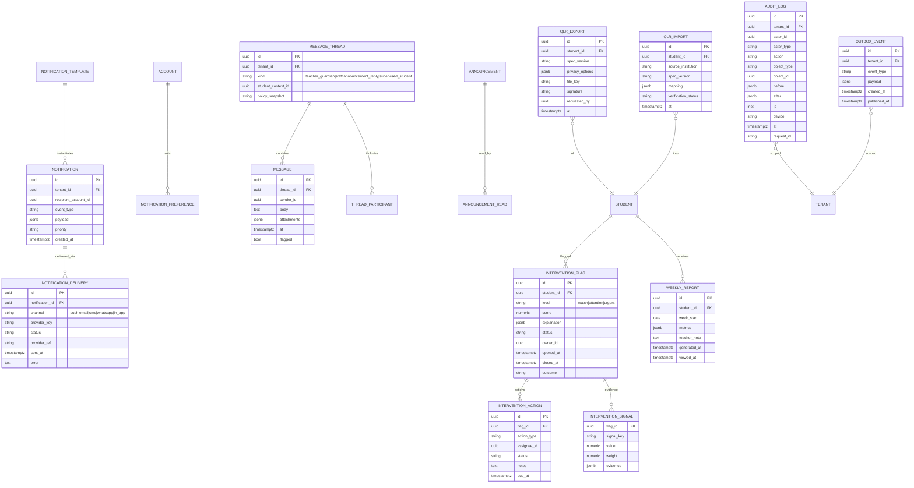

# 12 — High-Level Data Model and ERD

Conventions: every tenant-owned table has `tenant_id` (RLS), `id` (UUIDv7), `created_at`, `updated_at`, `created_by`; soft delete only where the domain needs it (people), hard delete elsewhere with audit. `ayah_index` is the global Ayah sequence within a Riwayah from the Quran Core. Diagrams are split by domain; cross-domain references are noted in text.

## 12.1 Identity, tenancy, permissions

## 12.2 People and enrollment

## 12.3 Quran Core (read-only, versioned; not tenant-scoped)

## 12.4 Quran learning (journey, memory map, retention, planning, Tasmee')

```mermaid
erDiagram
  STUDENT ||--|| QURAN_JOURNEY : has
  QURAN_JOURNEY ||--o{ JOURNEY_EVENT : timeline
  QURAN_JOURNEY ||--o{ STUDENT_AYAH_STATE : map
  STUDENT_AYAH_STATE ||--o{ AYAH_STATE_EVENT : history
  QURAN_JOURNEY ||--o{ RETENTION_SNAPSHOT : monthly
  LEARNING_POLICY ||--o{ POLICY_ASSIGNMENT : applied
  QURAN_JOURNEY ||--o{ DAILY_PLAN : planned
  DAILY_PLAN ||--o{ PLAN_SEGMENT : contains
  DAILY_PLAN ||--o{ PLAN_ACTION : teacher_actions
  QURAN_JOURNEY ||--o{ RECITATION_SESSION : recited
  RECITATION_SESSION ||--o{ RECITATION_SEGMENT : covers
  RECITATION_SESSION ||--o{ MISTAKE_EVENT : mistakes
  RECITATION_SESSION }o--o| LIVE_SESSION : during
  ASSESSMENT_DEFINITION ||--o{ ASSESSMENT : instances
  ASSESSMENT ||--|| RECITATION_SESSION : recorded_as
  QURAN_JOURNEY ||--o{ PRACTICE_SESSION : practiced
  PRACTICE_SESSION ||--o{ PRACTICE_EVENT : events
  PRACTICE_SESSION ||--o{ REVIEW_QUEUE_ITEM : flagged
  REVIEW_QUEUE_ITEM ||--o| DETECTOR_FEEDBACK : verdict
  QURAN_JOURNEY ||--o{ STUDENT_MUTASHABIHAT_ITEM : personal_set
  MISTAKE_TYPE ||--o{ MISTAKE_EVENT : classifies
  QURAN_JOURNEY ||--o{ IJAZAH_RECORD : granted
  QURAN_JOURNEY ||--o{ CERTIFICATE : awarded

  QURAN_JOURNEY { uuid id PK  uuid student_id FK  string riwayah  string mushaf_type  string status  date started_at  string direction  int current_ayah_index  int level  numeric velocity_pages_wk  numeric revision_compliance  string qc_version }
  JOURNEY_EVENT { uuid id PK  uuid journey_id FK  string event_type  jsonb payload  timestamptz occurred_at  uuid actor_id }
  STUDENT_AYAH_STATE { uuid journey_id FK  int ayah_index  string state  numeric retention_score  numeric stability_days  timestamptz last_recited_at  timestamptz last_passed_at  timestamptz memorized_at  int success_count  int fail_count  int mistakes_30d  timestamptz next_due_at  string engine_version  uuid override_by }
  AYAH_STATE_EVENT { uuid id PK  uuid journey_id FK  int ayah_index  string prev_state  string new_state  numeric prev_score  numeric new_score  string cause  uuid cause_ref  string engine_version  timestamptz occurred_at }
  RETENTION_SNAPSHOT { uuid journey_id FK  date snapshot_date  int juz  numeric avg_retention  int weak_ayat  int critical_ayat }
  LEARNING_POLICY { uuid id PK  uuid tenant_id FK  string key  int version  jsonb spec  string status }
  POLICY_ASSIGNMENT { uuid id PK  uuid policy_id FK  string target_type "tenant|branch|halaqah|student"  uuid target_id  date from  date to }
  DAILY_PLAN { uuid id PK  uuid journey_id FK  date plan_date  string status "proposed|approved|edited|overridden|done|carried"  jsonb rationale  uuid approved_by }
  PLAN_SEGMENT { uuid id PK  uuid plan_id FK  string purpose "new|near|far|mutashabihat|assessment"  int from_ayah_index  int to_ayah_index  int repetitions_required  string completion "pending|self_reported|verified" }
  PLAN_ACTION { uuid id PK  uuid plan_id FK  string action  jsonb before  jsonb after  uuid actor_id  timestamptz at }
  RECITATION_SESSION { uuid id PK  uuid journey_id FK  uuid teacher_id FK  uuid halaqah_id FK  string purpose  timestamptz started_at  timestamptz ended_at  string outcome "pass|repeat|partial"  numeric grade  text note  string note_visibility  string source "in_person|live|review_queue|assessment"  string idempotency_key }
  RECITATION_SEGMENT { uuid session_id FK  int from_ayah_index  int to_ayah_index  int repetitions }
  MISTAKE_EVENT { uuid id PK  uuid session_id FK  int ayah_index  int word_position  string mistake_type_key FK  string severity  int confused_with_ayah_index  text note  timestamptz at }
  MISTAKE_TYPE { string key PK  uuid tenant_id FK "null for standard"  string name  numeric default_weight  string default_severity }
  ASSESSMENT_DEFINITION { uuid id PK  uuid tenant_id FK  string name  jsonb scope  jsonb rubric  int passing_score  bool blind_second_examiner }
  ASSESSMENT { uuid id PK  uuid definition_id FK  uuid journey_id FK  uuid examiner_id  uuid second_examiner_id  timestamptz scheduled_at  numeric score  string result  jsonb feedback }
  PRACTICE_SESSION { uuid id PK  uuid journey_id FK  int from_ayah_index  int to_ayah_index  string mode  int hints_used  timestamptz started_at  timestamptz ended_at  bool self_reported_complete }
  PRACTICE_EVENT { uuid session_id FK  string event_type "hint_text|hint_audio|reveal|repeat|quiz_answer"  int ayah_index  jsonb payload  timestamptz at }
  REVIEW_QUEUE_ITEM { uuid id PK  uuid journey_id FK  uuid practice_session_id FK  int surah  int ayah  int start_ms  int end_ms  string suspected_issue  numeric confidence  string clip_key  timestamptz clip_expires_at  string status }
  DETECTOR_FEEDBACK { uuid item_id FK  uuid teacher_id  string verdict  string mistake_type_key  text note  timestamptz at  string provider_key  string model_version }
  STUDENT_MUTASHABIHAT_ITEM { uuid id PK  uuid journey_id FK  uuid group_id  int ayah_a  int ayah_b  int confusion_count  timestamptz last_confused_at  string status }
  IJAZAH_RECORD { uuid id PK  uuid journey_id FK  uuid grantor_staff_id FK  string riwayah  string scope  date granted_on  jsonb chain_notes  uuid[] witness_ids  uuid[] supporting_assessment_ids  uuid supersedes_id }
  CERTIFICATE { uuid id PK  uuid tenant_id FK  uuid student_id FK  string kind "hifz_milestone|course|assessment"  uuid template_id  string verification_code  timestamptz issued_at  uuid issued_by  string pdf_key }
```

## 12.5 Content library, Tafsir, Hadith

AI-generated assistance (summaries, transcriptions) is stored in `GENERATED_TEXT { id, tenant_id, purpose, provider_key, model_version, source_refs[], text, created_at }` with a non-null `source_refs` constraint for summaries; it can never be linked as a `CONTENT_WORK` of class `canonical` or `scholarly`.

## 12.6 Courses (LMS), exams, homework

Deterministic Quran quizzes reference Quran Core by `ayah_index` and generate options from verified text only (`QUESTION.content_class = canonical_derived`).

## 12.7 Scheduling, attendance, live sessions

## 12.8 Finance

## 12.9 Communication, notifications, intelligence, audit, portability

## 12.10 Key indexes and partitioning

- `STUDENT_AYAH_STATE (journey_id, ayah_index)` primary key; partial indexes on `next_due_at` and on `state IN ('weak','critical')`.
- `AYAH_STATE_EVENT`, `MISTAKE_EVENT`, `AUDIT_LOG`, `NOTIFICATION_DELIVERY`: monthly range partitions by `occurred_at`/`at`; `tenant_id` in every index.
- `RECITATION_SESSION (journey_id, started_at desc)`; `ATTENDANCE_RECORD (occurrence_id, student_id)` unique.
- `INVOICE (tenant_id, number)` unique; sequences per tenant via a `NUMBER_SEQUENCE` table.
- RLS policies on every tenant table; Quran Core tables have no `tenant_id` and are `SELECT`-only for the app role.

## 12.11 Retention and privacy fields

Tables holding media or minors' data carry `retention_until` and a `purge_job` handles deletion: `REVIEW_QUEUE_ITEM.clip_*` (default 30 days), `PRACTICE_EVENT` audio references (not retained by default), `LIVE_SESSION` recordings (only if allowed, tenant-defined), `MESSAGE.attachments`. Exports and deletions of a person are orchestrated through `DATA_SUBJECT_REQUEST { id, tenant_id, person_id, kind "export|delete", status, completed_at, bundle_key }`.
