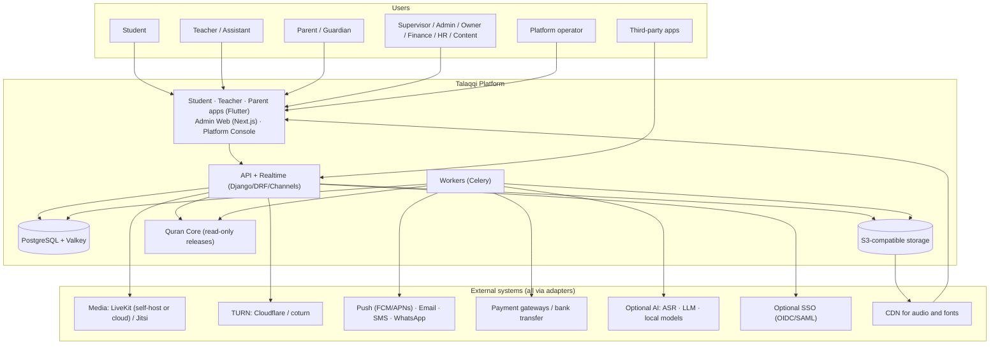
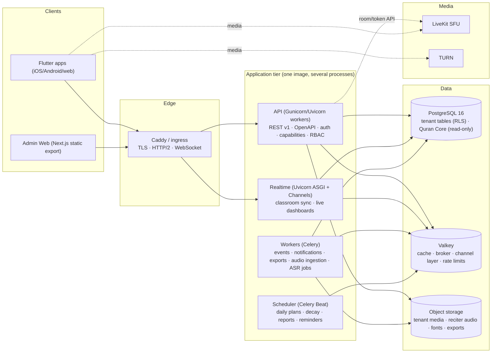
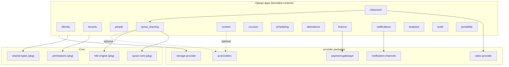

# 13 — System Architecture

## 13.1 System context (C4 level 1)

## 13.2 Container diagram (C4 level 2)

Deployment shapes (`docs/design/14-repository-structure.md` has the Compose profiles):

| Shape | Processes | Typical host |
|---|---|---|
| Small center | Caddy, api, realtime, worker+beat, PostgreSQL, Valkey, LiveKit (optional), Garage or external bucket | one VPS (2 vCPU/4 GB works; 4/8 comfortable) |
| Medium org | app nodes (api+realtime) ×2, worker node, managed or dedicated PostgreSQL with backups, Valkey, LiveKit node(s), object storage service | 3–5 nodes |
| Large org | HA PostgreSQL (primary + replica), Valkey Sentinel/Cluster, N app nodes behind LB, worker pool, LiveKit cluster with Redis, CDN, optional Kubernetes via Helm | cloud or dedicated |

## 13.3 Module boundaries (modular monolith)

Rules: services communicate through `services/<name>/api.py` (public functions) and **domain events**; no cross-service ORM joins outside read models; each service owns its tables; `analytics` builds read models from events.

## 13.4 Event architecture

- **Transactional outbox**: services write domain events to `OUTBOX_EVENT` in the same transaction as the state change; a relay publishes to Celery queues (and to webhooks). No dual-write problems.
- **Event envelope**: `{id, type, version, tenant_id, occurred_at, actor, payload, correlation_id, causation_id}`.
- **Consumers are idempotent** (dedupe on event id) and check module capability before acting.
- **Ordering**: per-aggregate ordering via sequence numbers where needed (journey events); global ordering not assumed.
- **Catalog (examples)**: `student.enrolled`, `attendance.recorded`, `recitation.recorded`, `mistake.recorded`, `ayah_state.changed`, `plan.proposed`, `plan.approved`, `assessment.completed`, `milestone.reached`, `review_item.created`, `review_item.resolved`, `live.session.opened/closed`, `invoice.issued`, `payment.received`, `intervention.flagged`, `report.weekly.generated`, `content.published`, `ijazah.recorded`, `permission.changed`, `tenant.module.changed`.
- **Webhooks**: tenant subscriptions with HMAC signatures, retries with backoff, replay from the outbox, per-event-type filtering.

## 13.5 Realtime architecture

| Channel | Transport | Purpose |
|---|---|---|
| Classroom sync | WebSocket (Channels) with Valkey layer | Mushaf position, pointers, roster, hand raise, mic grants |
| Live dashboards | WebSocket | Supervisor "today" view, Halaqah-in-progress |
| Notifications | Push (FCM/APNs) + in-app polling/WS | Alerts |
| Media | WebRTC via provider | Audio/video |

Scaling: Channels groups keyed by session; sticky sessions not required (Valkey layer); Centrifugo is a drop-in replacement path if fan-out exceeds Channels' comfort.

## 13.6 Storage architecture

| Bucket / prefix | Content | Access | Retention |
|---|---|---|---|
| `quran-audio/{reciter}/{version}/` | verified reciter audio | public CDN (open license) or signed (restricted) | permanent, versioned |
| `fonts/{pack}/{version}/` | font packs | public CDN | permanent |
| `tenants/{tenant}/media/` | logos, documents, submissions | signed URLs | tenant policy |
| `tenants/{tenant}/clips/` | review-queue clips | signed, short TTL | 30 days default |
| `tenants/{tenant}/recordings/` | only if recording allowed | signed | tenant policy |
| `tenants/{tenant}/exports/` | QLR and data-subject bundles | signed, one-time | 7 days |
| `quran-core/releases/` | release artifacts | public | permanent |

Uploads go through presigned URLs with content-type and size limits, then a virus scan job (ClamAV) before the object becomes referenceable. Images are re-encoded; PDFs sanitized; no SVG uploads.

## 13.7 Quran Core placement

`packages/quran-core` builds release artifacts → loaded into PostgreSQL (read-only role) for the API and into SQLite bundles for mobile → served by the read-only Quran API and the Mushaf renderer. See `06-quran-core-architecture.md`.

## 13.8 AI boundary

Optional providers sit behind Protocols in `packages/ai-providers`; they receive data, return `GeneratedText`/`RecitationAnalysis`, and have no write access to Quran Core, content classes `canonical`/`scholarly`, or the Memory Map. See `07-religious-ai-safety.md`.

## 13.9 Security architecture

| Threat | Control |
|---|---|
| Tenant data leakage | Scoped repositories + RLS + isolation tests + tenant-prefixed storage keys and cache keys |
| IDOR | All object access via scoped queries; 404 for out-of-scope; UUIDv7 ids |
| Privilege escalation | Role assignment requires `platform.rbac.assign` within scope; cannot assign permissions the assigner lacks; Ijazah grant permission only by owner |
| Child privacy | Guardian consent records, minimal fields, private notes visibility, messaging policy, retention jobs, DPIA template |
| Leaked recordings | Recording off by default; no egress component; separate bucket with short signed URLs when on |
| Unauthorized classroom joining | Backend join check (enrollment + time window + capability) before token issuance; random room keys; TTL ≤ 15 min; grants per role |
| Impersonation | MFA for staff roles, device binding for refresh tokens, login alerts, teacher identity verified by tenant |
| Payment attacks | Gateway webhooks verified; idempotent payment creation; amounts computed server-side; refunds require permission + audit |
| Malicious uploads | Presigned uploads with type/size limits, ClamAV scan, re-encoding, no SVG/HTML |
| XSS | React/Flutter escape by default; CSP with nonces; sanitized rich text (allowlist) |
| CSRF | SameSite cookies + CSRF tokens for web sessions; JWT for mobile |
| SQL injection | ORM only; raw SQL reviewed and parameterized |
| SSRF | Outbound fetch only through an allowlisted HTTP client (webhook targets validated, no private IPs) |
| Broken JWT validation | Short-lived RS256/EdDSA tokens with `kid`, key rotation, audience/issuer checks, refresh rotation with reuse detection |
| Insecure media URLs | Signed URLs with short TTL; no public buckets for tenant media |
| API abuse | Per-tenant and per-token rate limits (Valkey), request size limits, idempotency keys, anomaly alerts |
| Secrets | Env/secret manager; never in client bundles; LiveKit API secret only server-side |
| Supply chain | Pinned dependencies, `pip-audit`/`npm audit`, CodeQL, Trivy, signed releases |

## 13.10 Observability

- **Logs**: structured JSON (`structlog`) with `tenant_id`, `request_id`, `actor_id`; no PII bodies, never media.
- **Metrics**: Prometheus exporters (API latency, queue depth, planner runtime, retention job duration, notification delivery rates, live session quality).
- **Traces**: OpenTelemetry across API → worker → DB.
- **Audit**: application-level audit log (see 12.9), immutable, exportable.
- **Health**: `/healthz` (liveness), `/readyz` (DB, Valkey, storage, Quran Core checksum), worker heartbeat.
- **Tenant usage**: active students, sessions, minutes, storage, notifications per tenant (for both self-host insight and cloud billing).
- **Error tracking**: Sentry or GlitchTip with PII scrubbing.
