# 14 — Repository Structure and Open-Source Setup

## 14.1 Monorepo layout

One repository (`talaqqi/talaqqi`) with a monorepo, because the domain packages, API, and three client surfaces change together and share types. Separate repositories are reserved for large data artifacts (`talaqqi/quran-core-data`, git-LFS) and community adapters.

```
talaqqi/
├── apps/
│   ├── api/                    # Django project: settings, urls, asgi/wsgi, management commands
│   ├── admin-web/              # Next.js + TypeScript (admin, supervisor, finance, content, platform console)
│   └── mobile/                 # Flutter: one codebase, role shells (student, teacher, parent)
│       ├── lib/features/…      # today, mushaf, practice, journey, tasmee, classroom, parent, courses
│       ├── lib/core/quran/     # SQLite Quran Core access, renderer, audio cache
│       └── packages/           # Dart packages: design_system, api_client (generated), rtc_client
├── services/                   # Django apps = bounded contexts (thin)
│   ├── identity/ tenants/ people/ quran_learning/ content/ courses/ classroom/
│   ├── scheduling/ attendance/ finance/ notifications/ analytics/ audit/ portability/
│   └── platform/               # platform console, tenant provisioning, releases
├── packages/                   # pure Python domain and provider packages (no Django)
│   ├── quran-core/             # accessor, build scripts, validation suite, snapshots
│   ├── hifz-engine/            # retention engine, planner, policy schema + templates
│   ├── permissions/            # catalog, capability resolution, RBAC
│   ├── shared-types/           # Pydantic models; exported to TS (openapi) and Dart
│   ├── video-provider/         # RtcProvider Protocol + livekit/, jitsi/
│   ├── storage-provider/       # S3-compatible + local
│   ├── notification-channels/  # push/email/sms/whatsapp adapters
│   ├── payment-gateways/       # manual/bank, stripe, paymob, …
│   ├── ai-providers/           # Null, local ASR, cloud ASR/LLM adapters
│   └── design-system/          # tokens (JSON) → CSS vars + Dart theme; React components; Flutter widgets
├── infra/
│   ├── docker/                 # Dockerfiles (api, worker, admin-web), entrypoints
│   ├── compose/                # docker-compose.yml + profiles: dev, single-vps, medium
│   ├── caddy/                  # Caddyfile templates
│   ├── livekit/                # livekit.yaml templates, coturn config
│   ├── helm/                   # optional chart (later)
│   └── scripts/                # backup/restore, migrate, seed, quran-core load
├── docs/
│   ├── design/                 # this design package
│   ├── research/               # sourced research
│   ├── adr/                    # architecture decision records (MADR format)
│   ├── api/                    # generated OpenAPI + guides
│   ├── deployment/             # single VPS, medium, HA guides; provider setup (LiveKit, storage, email…)
│   ├── development/            # local setup, conventions, testing
│   └── safety/                 # religious safety model, content provenance policy, Quran Core release process
├── tests/                      # cross-cutting: isolation, permission matrix, quran-core integrity, e2e
├── .github/
│   ├── workflows/              # ci.yml, quran-core-integrity.yml, release.yml, codeql.yml, mobile.yml
│   ├── ISSUE_TEMPLATE/         # bug, feature, quran-text-issue (special handling), security (points to policy)
│   ├── PULL_REQUEST_TEMPLATE.md
│   └── CODEOWNERS              # packages/quran-core/data/** requires 2 reviewers from @quran-core-reviewers
├── pyproject.toml              # uv/poetry workspace; ruff, mypy config
├── package.json                # pnpm workspace (admin-web, design-system)
├── melos.yaml                  # Flutter monorepo tooling
├── Makefile                    # make dev / test / lint / seed / quran-core-load
├── README.md  CONTRIBUTING.md  CODE_OF_CONDUCT.md  SECURITY.md  GOVERNANCE.md  LICENSE  NOTICE  TRADEMARKS.md
```

## 14.2 License strategy

| Component | License | Reasoning |
|---|---|---|
| Platform code (apps, services, packages) | **AGPL-3.0** | Keeps improvements open even when the software is offered as a hosted service; protects the community from closed forks of a social-impact project. A future managed cloud by the project itself is unaffected. Commercial dual-licensing remains possible for the copyright holder if contributors sign a lightweight DCO (not CLA). |
| SDKs, API client libraries, shared types, design tokens | **MIT** | Third-party apps must be able to integrate without AGPL obligations |
| Quran Core build tools and validation | MIT | Encourage reuse by other Quran projects |
| Quran Core data artifacts | Per-source licenses (documented in `LICENSE-DATA.md`); only redistributable sources shipped | See `docs/research/audio-and-content-licensing.md` |
| Fonts | Per-font (OFL for DigitalKhatt/Amiri/SIL; KFGQPC files shipped unmodified with their notice or fetched by the operator) | |
| Documentation | CC BY 4.0 | |
| Trademark | "Talaqqi" name and logo governed by `TRADEMARKS.md` (use allowed for unmodified self-hosting; forks must rename) | |

Decision recorded in ADR-0001; the choice between AGPL and Apache-2.0 should be confirmed by the founding team before the first public release, since it is hard to change later. If maximizing adoption by commercial vendors matters more than protecting against closed SaaS forks, Apache-2.0 is the alternative.

## 14.3 Governance and contribution

- `GOVERNANCE.md`: maintainers, a **Quran Core review board** (named reviewers with recitation qualifications for text/audio/Mutashabihat data), a security team, and a decision process (lazy consensus, ADRs for architecture).
- `CONTRIBUTING.md`: setup, branch naming, conventional commits, DCO sign-off, test requirements, how to propose a module, how to add a provider adapter, translation workflow.
- `CODE_OF_CONDUCT.md`: Contributor Covenant with an addition on respectful handling of religious content and disagreements.
- `SECURITY.md`: private disclosure address, 90-day coordinated disclosure, supported versions, GitHub private vulnerability reporting enabled.
- Issue templates: bug, feature, **Quran text issue** (routes to the review board, requires source citation), data/licensing issue, deployment help.
- Labels: `module:*`, `safety-class:red|yellow|green`, `quran-core-release`, `good first issue`, `needs-scholar-review`.

## 14.4 Documentation set

- Architecture Decision Records (`docs/adr/0001-license.md`, `0002-modular-monolith.md`, `0003-django-drf.md`, `0004-flutter.md`, `0005-shared-schema-rls.md`, `0006-quran-core-immutability.md`, `0007-video-provider-livekit.md`, `0008-valkey.md`, `0009-retention-engine-v1.md`, …).
- API docs generated from OpenAPI (`drf-spectacular`) with guides: authentication, tenants, pagination, filtering, idempotency, webhooks, versioning.
- Deployment guides per shape; provider setup guides (LiveKit self-host, LiveKit Cloud, Cloudflare TURN, Garage, R2, SES, FCM, WhatsApp Cloud API).
- Safety docs: religious safety model, provenance policy, Quran Core release process, ASR limitations statement, recording policy statement.
- Developer docs: local environment, seeding demo data, running tests, adding a module, adding a provider, translation.

## 14.5 Local development

```bash
git clone https://github.com/Osama-BanyHamad/tallaqi && cd talaqqi
make dev            # docker compose --profile dev up: postgres, valkey, garage, mailpit, livekit-dev
make migrate seed   # migrations + demo tenant (center with 3 halaqat, 30 students, teachers, parents, plans)
make quran-core     # download + verify + load the pinned Quran Core release
make api            # runs Django dev server (or use compose service)
make web            # Next.js dev server
make mobile         # flutter run (points at local API)
make test           # unit + integration + permission matrix + isolation + quran-core integrity
```

Requirements: Docker, Python 3.12 (uv), Node 20 (pnpm), Flutter stable. Everything else runs in containers. A `.devcontainer` is provided.

## 14.6 CI pipeline

```mermaid
flowchart LR
  A["lint + format<br/>ruff · mypy · eslint · dart analyze"] --> B["unit tests<br/>packages + services"]
  B --> C["integration tests<br/>PostgreSQL + Valkey services"]
  C --> D["permission matrix + tenant isolation + IDOR"]
  D --> E["Quran Core integrity<br/>checksums vs snapshots"]
  E --> F["API contract (schemathesis) + OpenAPI diff"]
  F --> G["security<br/>CodeQL · pip-audit · npm audit · Trivy"]
  G --> H["build images + Flutter builds"]
  H --> I["E2E (Playwright) on labeled PRs and main"]
  I --> J["release: tag → images → changelog → GitHub release"]
```



Branch protection: required checks, two approvals for `packages/quran-core/data/**` and `docs/safety/**`, signed tags for releases.

## 14.7 Deployment profiles

| Profile | `docker compose --profile` | Services |
|---|---|---|
| `dev` | dev | postgres, valkey, garage, mailpit, livekit (dev keys), api (autoreload), worker, admin-web (dev) |
| `single-vps` | single-vps | caddy, api, realtime, worker+beat, postgres (with pgBackRest to S3), valkey, optional livekit+turn, optional garage |
| `medium` | medium | caddy/LB, api ×N, realtime ×N, worker ×N, external postgres (managed or dedicated node), valkey, livekit node(s) with redis, object storage endpoint |
| Kubernetes | Helm chart (later) | same components as Deployments/StatefulSets; optional |

Backups: nightly PostgreSQL base backups + WAL to object storage (pgBackRest or WAL-G), object storage replication for tenant media, documented restore drill.
